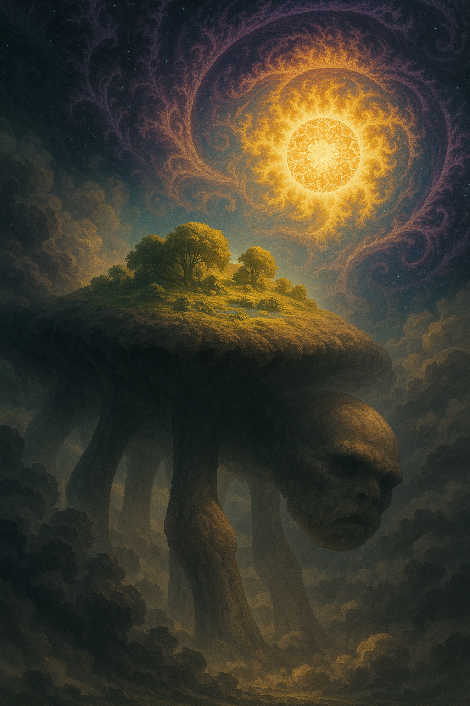

<!-- wiki-header-section:start -->
# Alwa
_Shadow of Gaia_

<i>Beneath the fractal deep space, Alwa’s colossal fungal limbs anchor Gaia's sanctuary beneath the Toman sun.</i></img>

**Alwa** was a primordial being that dominated during the [[Cel Blindbirth Line]], when surviving [[Huma]] populations of the [[Taxotheir Line]] fled to the subterrainean underbelly of [[Endem]]. Alwa was a primordial, exhibiting superior polyresonance, comprised of the essence of [[Celia]], [[Huma]], [[Natura]], [[Bluma]], and [[Spira]]. Her colossal body, at the peak of her evolution, blocked the sun, altered landscapes, and consumed the beliefs and souls of the fallen en masse. Her ascension ended the Cel Blindbirth Line, leaving behind remains ([[Primma]], [[Aprima]], [[Lifesoil]], and [[Sky Matter]]) that became vital resources in the subsequent development of Huma civilization in her wake. Alwa is a cautionary figure in [[Sol Unita]] folklore, representing the dangers of unchecked Celia power and the justification for the [[Rite of Recomposition]].

<!-- wiki-header-section:end -->

<!-- taxonomy-table-section:start -->

  <table>
    <tr>
      <th colspan="3">Purpose Taxonomy</th>
    </tr>
    <tr>
      <td class="taxon-label">Bin:</td>
      <td class="taxon-content" colspan="2">[[Scape]]</td>
    </tr>
    <tr>
      <td class="taxon-label">Basin:</td>
      <td class="taxon-content" colspan="2">[[Sacrus]]</td>
    </tr>
    <tr>
      <td class="taxon-label">Eco:</td>
      <td class="taxon-content" colspan="2">[[Toma]] of [[Toman Ecoss]]</td>
    </tr>
    <tr>
      <td class="taxon-label">Kingdom:</td>
      <td class="taxon-content" colspan="2">[[Resonant]] ([[Primordial]], [[Celia]]-[[Huma]]-[[Natura]]-[[Bluma]]-[[Spira]])</td>
    </tr>
    <tr>
      <td class="taxon-label">Phylum:</td>
      <td class="taxon-content" colspan="2">[[Preservus]]</td>
    </tr>
  </table>

<!-- taxonomy-table-section:end -->

## Physical Characteristics

Alwa’s physical form was both terrifying and awe-inspiring. She appeared like a colossal entity reminiscent of a daddy-longlegs spider, though not truly one—her main abdomen was composed of a white, fleshy fungal material, vast and vessel-like. Her many legs, also made of this pale fungal substance, protruded downwards and dug deep into the soil, rock, and subterranean layers of the plane, anchoring her body across all continents. Folklore claims that these legs penetrated the world itself, drawing up the essence of the land and its people, and feeding on the Huma population during the Cel Blindbirth Line.

Her immense body was positioned beneath the sun at the center of the plane, slowly rising as she siphoned resources from below. This act benefitted the Bluma and the land atop her body, which became lush and fertile. The top of Alwa’s body carried soil, plants, water, and the Imaan Plane of Gaia—a realm of peace and infinite rebirth—casting a vast shadow over all of Toma as she blocked out the sun to benefit her own ascension.

The most unsettling aspect of Alwa was her head: a human-like face, eerily expressionless, with uncanny proportions and features that evoked discomfort and fear. This head could protrude and move freely, reappearing from any point on her entire body, not just from a fixed neck or location. Its presence was unpredictable, surveying her domain with a blank, unsettling gaze that seemed to lack true emotion or intent.

## Influence and Impact

Alwa’s influence was so great that her body blocked out the sun over vast regions, particularly over [[Arkon]], creating a perpetual shadow that devastated the ecosystems dependent on sunlight. Her power was fed by the souls of the fallen, particularly the Huma who perished during the [[Taxotheir Line]] (Pre-Endem) and [[Cel Blindbirth Line]] (Endem). As she consumed the beliefs and essence of these beings, her power grew exponentially, making her a nearly unstoppable force.

The [[Imaan Plane]] known as [[Gaia]] was formed on top of Alwa, drawing energy from the sun that she blocked out. This plane fed off her immense power, further amplifying her influence across the Toman Ecoss. Alwa’s presence also disrupted the natural order, particularly the [[Dance of Spira]], as she claimed the Spira and other souls that were meant to be guided by [[Behinyu]] and [[Never]].

## Legacy and Ascension

Alwa’s end came with her ascension, a process that saw her soul rise to a higher dimension, leaving behind her vast physical form. This event marked the end of the [[Cel Blindbirth Line]] and the beginning of a new era. Her remains, composed of [[Primma]] and the purest form of it, [[Aprima]], became integral to the development of various civilizations, particularly in [[Sol Unita]].

Her ascension led to a significant shift in the [[Dance of Spira]], making room for the souls of [[Gaia]] and marking a profound change in the spiritual landscape of the Toman Ecoss. Alwa’s story serves as a powerful reminder of the dangers of unchecked power and the consuming nature of greed and envy, as her insatiable hunger ultimately led to her downfall.

## Cultural Significance

Alwa’s legacy lives on in the folklore and religious practices of various cultures within the Toman Ecoss. In [[Sol Unita]] folklore, the story of the **[[Reins of Alwa]]** is central: it tells how the Presceptists severed Alwa’s legs, toppling her into the sea and ending her reign of shadow. This myth is invoked as the origin of the [[Rite of Recomposition]], justifying the use of technology and stewardship to guide the cycles of life and death, and is seen as a founding story for Sol Unita society. Stories like the Reins of Alwa serve as moral lessons against the unchecked pursuit of power and the consequences of disrupting the natural order.

The [[Scepitath]], early founders of Asceptim, used Alwa’s story to justify their separation from the Celia Kingdom, enforcing strict laws against the use of Celia-based magic and technologies. Her influence on the world is still felt today, both in the material remnants of her body and in the cultural and spiritual practices that continue to be shaped by her existence.

<!--
## Remnants and Synoptic Resources

Parts of [[Arkon]] have Alwa’s remains. Glimpse was made possible by the decline of Alwa, creating a small hospitable land and resource upon which the Throne of Trenjor was constructed. Alwa’s remains can also be found in the depths of the swirling sea and various other locations around the world.

Alwa’s ascension made the [[Synoptic Resource|Synoptic Resources]]:
- [[Aprima]]
- [[Lifesoil]]
- [[Sky Matter]]

-->

## Related Wiki Pages
- [[Celia]]
- [[Primordial]]
- [[Rite of Recomposition]]
- [[Sol Unita]]
- [[Aprima]]
- [[Lifesoil]]
- [[Sky Matter]]
