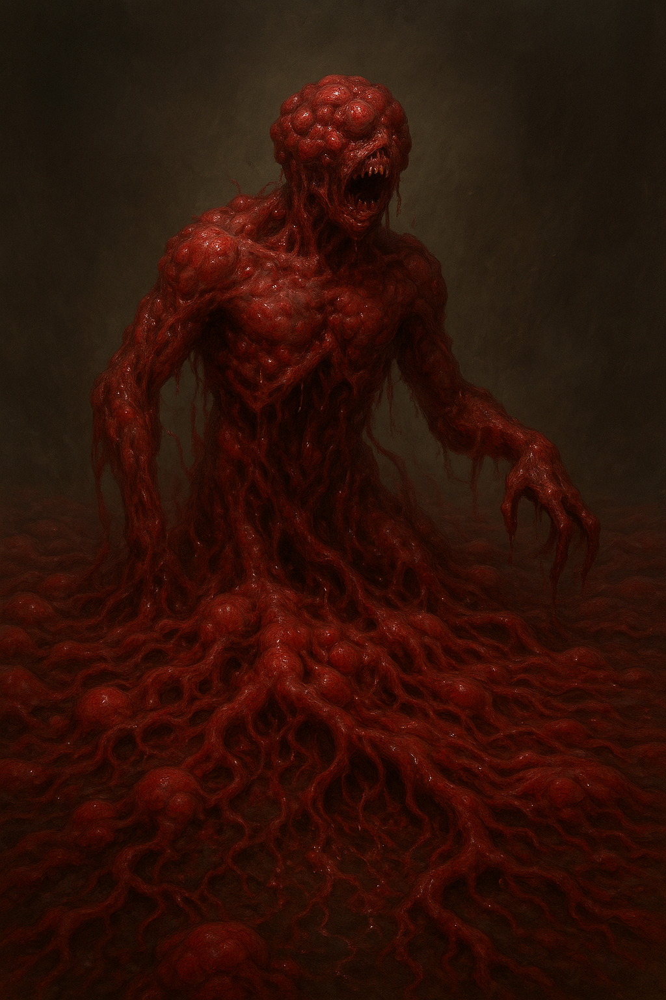

<!-- wiki-header-section:start -->
# Decara
_Bacteria Kingdom_

<i><!--A Decara warps the ground's bacterial mass into the form of a fallen Huma through mimidry, twisting the fleshy substance until illusion and anatomy bleed into one.--></i></img>

> _"When we unearthed the obsidian mask, its surface still etched with the marks of ritual decay, we realized the Decara’s legacy was not one of mere survival, but of relentless, unrepentant destruction. The artifact radiated a cold certainty: nothing in their path was ever left whole."_  
> **—Dr. Hylen Voss, Sol Unita Archaeological Corps**

**Decara** is an ancient kingdom of destruction within the [[Toman Ecoss]], composed of both archaea and bacteria. Throughout most of Toma, the Decara Kingdom is thought to be extinct or no longer exist, but in small, hidden pockets of the eco, the Decara are known to persist—though not always under that name or in their original form (resonance). The story of the Decara has been loosely reconstructed through archaeological efforts, spearheaded by Sol Unita and their alliances. Much of what is known comes from the study of ruins and artifacts, as well as the analysis of Social Taxonomy (Taxotheir Line), the taxonomic system in use when the Decara were believed to roam Toma.

The Decara have played a pivotal role in shaping the history and ecology of the plane, existing since the creation of [[Toma]]. Their influence is deeply woven into the fabric of Toma, manifesting through cycles of destruction, adaptation, and the relentless pursuit of ascension.
<!-- wiki-header-section:end -->

<!-- taxonomy-table-section:start -->

  <table>
    <tr>
      <th colspan="3">Purpose Taxonomy</th>
    </tr>
    <tr>
      <td class="taxon-label">Bin:</td>
      <td class="taxon-content" colspan="2">[[Scape]]</td>
    </tr>
    <tr>
      <td class="taxon-label">Basin:</td>
      <td class="taxon-content" colspan="2">[[Sacrus]]</td>
    </tr>
    <tr>
      <td class="taxon-label">Eco:</td>
      <td class="taxon-content" colspan="2">[[Dar]] and [[Toma]] of [[Toman Ecoss]]</td>
    </tr>
    <tr>
      <td class="taxon-label">Kingdom:</td>
      <td class="taxon-content" colspan="2"><b>Decara</b></td>
    </tr>
  </table>

<!-- taxonomy-table-section:end -->

<!--## Main Section

The origin of **Decara** traces back to the [[Two Virus Mythos]], a primordial struggle between [[Gorisain]] and [[Desthema]] that shaped the nature of bacteria and decay within Toma. The Decara kingdom is marked by its adaptability and the instinctual drive for destruction, often targeting the foundations of life and creation. Their worship of Gorisain, the Protomartyr and Nesa of the Decara, is central to their culture and rituals.

Decaran creatures are identifiable by the shade of their blood, which changes with age—from fleshy pink in newborns to metallicized gray in ancient creatures. The kingdom is further divided into subkingdoms, each with distinct roles, such as [[Bluthrut]], [[Darit]], [[Defiled]], [[Mimidry]], [[Proto]], and [[Veirgo]].

A defining trait of the Decara is their ritualistic feasting, where the consumption of living creatures and corpses is both a spiritual and practical act. These feasts, held twice daily, are believed to influence the growth and adaptation of Decaran society. The Decara have also constructed intricate tunnel systems, serving as places of worship and connection to Gorisain’s consciousness in the [[Soul Fields]].

The Decara’s relentless pursuit of ascension is driven by the prophecy of The Carrion, which foretells the rise of an individual who will lead Gorisain into the next dimension. Their destructive nature is not merely an empire function but an ideology under Gorisain’s guidance, shaping their actions and aspirations across the Toman Ecoss.

## Related Wiki Pages

- [[Toman Ecoss]]
- [[Gorisain]]
- [[Soul Fields]]
- [[Mimidry]]
- [[Bluthrut]]
- [[Darit]]
- [[Defiled]]
- [[Proto]]
- [[Veirgo]]
- [[Two Virus Mythos]]
- [[Bacillus Ascendancy]]
- [[Basilica]]

<!-- not-for-live-publishing:start -->
<!-- obsidian-pull:start -->
**Bin**: [[Scape]]  
**Basin**: [[Sacrus]]  
**Eco**: [[Dar]] and [[Scape (TTRPG)/1 Purpose Taxonomy/Complete Taxonomy/02 Eco/01 Toman Ecoss/02 Toma/Toma]] of [[Toman Ecoss]]
**Kingdom**

The [[Decara]] kingdom is a primordial and destructive force within the [[Toman Ecoss]]. Consisting of both archaea and bacteria, the Decara kingdom played a pivotal role in shaping the plane's history and ecology, existing since the creation of [[Scape (TTRPG)/1 Purpose Taxonomy/Complete Taxonomy/02 Eco/01 Toman Ecoss/02 Toma/Toma]].

### Origin

The Decara have existed since the creation of Toma, arising from the chaos and conflict of the [[Two Virus Mythos]], which tells of the primordial struggle between [[Gorisain]] and Desthema. This mythos describes the early battle for dominance that shaped the nature of bacteria and decay within Toma, leading to Gorisain's eventual dominance.

### Appearance

Decaran creatures are identifiable by the shade of their blood, which indicates their age:

- **Newborn**: Fleshy pink, similar to human gums.
- **Juvenile**: Bright, vivid red.
- **Adult**: Darkened, dull red.
- **Elder**: Deep, dark crimson red.
- **Nesa**: Metallicized, grainy dark gray, with pockets of youthful shades.

### Mimidry

The Decara possess a unique form of adaptation known as [[Mimidry]], which allows them to mimic traits and physical forms of other kingdoms while retaining their bacterial composition. These rare creatures are called mimids and differ from regular [[Spira#Mimic|Mimics]].

### Subdecara

The Decara kingdom is further classified into several subkingdoms, each with distinct roles and functions:

- [[Bluthrut]] (Bluma Mimid)
- [[Darit]]
- [[Defiled]]
- [[Mimidry]]
- [[Proto]]
- [[Veirgo]]

### Choice of Destruction

Destruction is an instinctual behavior deeply ingrained in the Decara. They prioritize actions that cause maximum destruction, often targeting foundations and "Makers," such as females and plants, as these are considered primary sources of life and creation in the [[Bacillus Ascendancy]] and the teachings of [[Basilica]].

### Worship of Gorisain

The Decara revere [[Gorisain]], a once-mortal leader and now a [[Nesa|Nesa of Kingdoms]], as their deity. Gorisain was a war general and leader during the [[Natural War]], a time of intense conflict and transformation. The Decara believe in the prophecy of The Carrion, which foretells the ascension of an individual who will lead Gorisain into the next dimension.

#### The Carrion Prophecy

According to Decaran belief, the universe is fated to ascend. Gorisain nearly achieved this through a significant belief event, but he became a lesser god instead. Now, he and the Decara search for The Carrion, an individual believed to facilitate Gorisain's ascent. Gorisain aspires to enhance his ascension proficiency to control everything by becoming infinity itself.

#### Decaran Tunnels and Worship Systems

The Decara have built an intricate system of tunnels that serve as places of worship and are believed to be extensions of Dar, Gorisain’s body. These tunnels connect Decarans to Gorisain’s consciousness in the Soul Fields. The Decara feel a compulsion to connect with their deity through these tunnels, embodying their faith and hope for ascension.

#### Ritualistic Feasting

Feasting is a ritual ingrained in Decaran culture, involving the consumption of living creatures and corpses transported to the Decaran homeland. These feasts are regional events occurring twice daily, aligned with the day and night cycle. The consequences of these rituals, such as [[Natural Disasters|natural disasters]], are attributed to the inability of [[Spira]] to reach the [[Soul Well]].

The consumption of corpses produces Decaran biowaste, consumed by the [[Dar#Gorrbis|Gorrbis]] of Dar, which influences growth and adaptation within Decaran society.

### Domains

[[Gorisain]], the Protomartyr and Nesa of the Decaran kingdom, governs the domains of suffering, bacteria, death, sin, pestilence, murder, and massacre. His influence is pervasive, shaping the destructive tendencies of the Decara and their relentless pursuit of power and control.

### Legacy

The Decara kingdom's influence is deeply woven into the fabric of Toma's history and ecology. Their destructive nature and devotion to Gorisain have left an indelible mark on the plane, shaping the evolution and dynamics of the kingdoms that followed. Their quest for ascension and fulfillment of The Carrion Prophecy continues to drive their actions and aspirations.

As a result of having their own plane, Decaran deaths produce more variations of materials attached to the core of their beliefs. If any other creature has a plane, this happens as well.

Decara’s Empire Function is not actually destruction. instead, it is their ideology under Gorisain that causes this. 
<!-- obsidian-pull:end -->
<!--
This section is for content, lore, or discoveries that are NOT meant for live publishing to the site. 
Leave this empty unless specifically requested. Use this to stage information that will be revealed to players later.
-->
<!-- not-for-live-publishing:end -->
