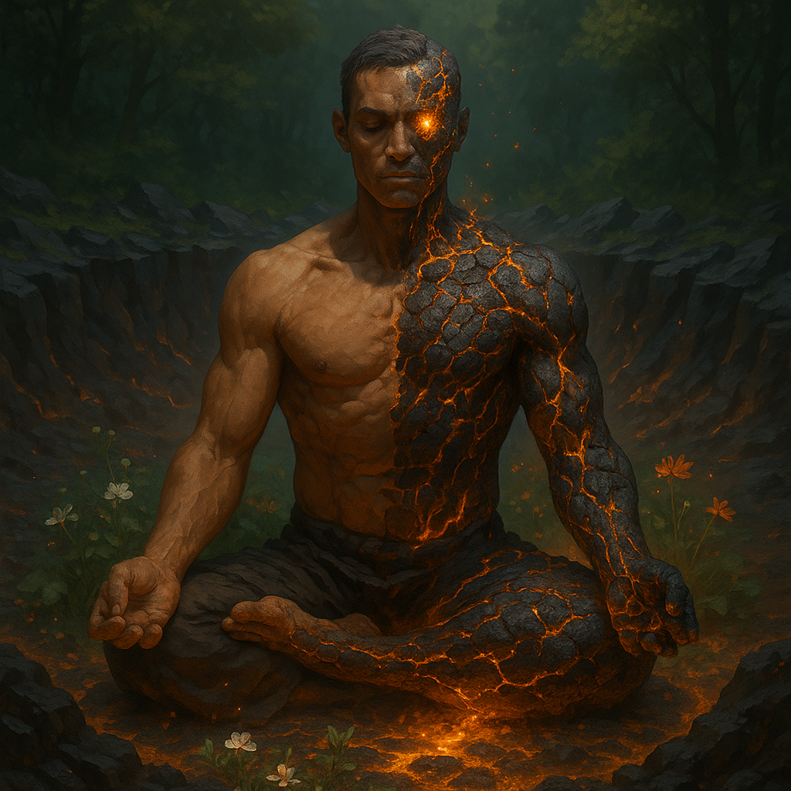

# Essnt

<i>An Essnt of the [[Alflame]] in meditation: half flesh, half volcanic stone, seated in a crater-ringed glade where flowers bloom and wilt with every breath—his molten veins glow with introspective power, and his star-lit eye gazes inward toward the balance of nature and self.</i></img>

  <table>
    <tr>
      <th colspan="3">Purpose Taxonomy</th>
    </tr>
    <tr>
      <td class="taxon-label">Bin:</td>
      <td class="taxon-content" colspan="2">[[Scape]]</td>
    </tr>
    <tr>
      <td class="taxon-label">Basin:</td>
      <td class="taxon-content" colspan="2">[[Sacrus]]</td>
    </tr>
    <tr>
      <td class="taxon-label">Eco:</td>
      <td class="taxon-content" colspan="2">[[Toma]] of [[Toman Ecoss]]</td>
    </tr>
    <tr>
      <td class="taxon-label">Kingdom:</td>
      <td class="taxon-content" colspan="2"><strong>Essnt</strong> ([[Huma]] + [[Natura]] [[Resonant]])</td>
    </tr>
  </table>

An **Essnt** is a unique classification of [[Resonant]] that embodies both the [[Huma]] and [[Natura]] kingdoms. Essnts are uncommon, but have existed through all periods of recorded history as a minority of hybrid entities whose existence bridges the gap between humanity and the natural world, granting them abilities, perspectives, and traits from both realities. The most notable Essnts in the [[Current Line]] are the three sisters of the [[Ahdom Few]], each collectivizing their power with a different aspect of the physical world: water, land, and sky.

## Essnt Triarchy: Ahdom Few

The ruling triarchy of [[Hypri]], known as the [[Ahdom Few]], are all Essnts:
- **[[Ximena Lathen]]** — Water Essnt, Drakemaster of [[Lopali]]
- **[[Jarma Konich]]** — Land Essnt, Drakemaster of [[Kautiger]]
- **[[Siela Qane]]** — Sky Essnt, Drakemaster of [[Qa'ura]]

Each sister embodies the union of Huma and Natura in her own domain, wielding powers that reflect their dual heritage and acting as a living bridge between the human and natural orders.

## Nature and Role

Essnts are defined by their resonance between kingdoms. This duality grants them unique magical abilities, deep empathy for both human and natural concerns, and the capacity to mediate or command forces that would otherwise be at odds. In the case of the Ahdom Few, their Essnt nature is the foundation of their authority and the source of their ability to control the primordial drakes.

## Related Wiki Pages

- [[Resonant]]
- [[Ahdom Few]]
- [[Hypri]]
- [[Ximena Lathen]]
- [[Jarma Konich]]
- [[Siela Qane]]
- [[Lopali]]
- [[Kautiger]]
- [[Qa'ura]]
