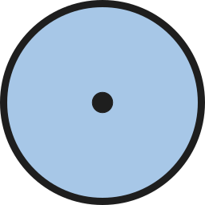

<!-- wiki-header-section:start -->
# Gekido

<i></i></img>

Gekido is a...
<!-- wiki-header-section:end -->

<!-- taxonomy-table-section:start -->

  <table>
    <tr>
      <th colspan="3">Purpose Taxonomy</th>
    </tr>
    <tr>
      <td class="taxon-label">Bin:</td>
      <td class="taxon-content" colspan="2">[[Scape]]</td>
    </tr>
    <tr>
      <td class="taxon-label">Basin:</td>
      <td class="taxon-content" colspan="2">[[Sacrus]]</td>
    </tr>
    <tr>
      <td class="taxon-label">Eco:</td>
      <td class="taxon-content" colspan="2">[[Toma]] of [[Toman Ecoss]]</td>
    </tr>
    <tr>
      <td class="taxon-label">Kingdom:</td>
      <td class="taxon-content" colspan="2">[[Anthros]]</td>
    </tr>
    <tr>
      <td class="taxon-label">Phylum:</td>
      <td class="taxon-content" colspan="2"></td>
    </tr>
    <tr>
      <td class="taxon-label">Class:</td>
      <td class="taxon-content" colspan="2"></td>
    </tr>
    <tr>
      <td class="taxon-label">Order:</td>
      <td class="taxon-content" colspan="2"></td>
    </tr>
    <tr>
      <td class="taxon-label">Family:</td>
      <td class="taxon-content" colspan="2"></td>
    </tr>
    <tr>
      <td class="taxon-label">Essa:</td>
      <td class="taxon-content" colspan="2"></td>
    </tr>
  </table>

<!-- taxonomy-table-section:end -->

## Main Section

