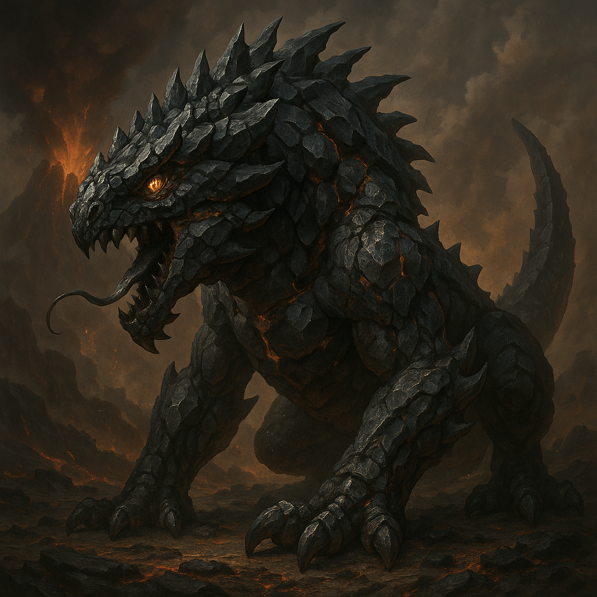

<!-- wiki-header-section:start -->
# Grokauw
_Lavaspitter Basilisk, Magmaw, Kro'Tan Furnace_

<i>A Grokauw basking in the glow of a [[Kro'Tan|Kro'Tanic]] magma pit.</i></img>

> "The Grokauw does not hunger. It waits. It judges. When the pit boils and the stone cracks, it chooses who will burn and who will crawl out changed. I have seen its eyes—red as the world’s wound. I have thrown men to it, and I have heard them scream."
> **—Gorvash the Ash-Tongue, Lavaspitter Chieftain**

The Grokauw is a legendary basilisk native to the volcanic continent of [[Kro'Tan]], feared and revered by the orcish clans who dwell there. Dwelling deep within magma pits, these colossal creatures have, over centuries, become one with the volcanic rock, their bodies suffused with molten stone and their presence marking the most dangerous and sacred sites in orcish territory. The Grokauw is both executioner and idol, its hunger sated by ritual sacrifice and the slow, relentless consumption of the earth itself.

<!-- wiki-header-section:end -->

<!-- taxonomy-table-section:start -->

  <table>
    <tr>
      <th colspan="3">Purpose Taxonomy</th>
    </tr>
    <tr>
      <td class="taxon-label">Bin:</td>
      <td class="taxon-content" colspan="2">[[Scape]]</td>
    </tr>
    <tr>
      <td class="taxon-label">Basin:</td>
      <td class="taxon-content" colspan="2">[[Sacrus]]</td>
    </tr>
    <tr>
      <td class="taxon-label">Eco:</td>
      <td class="taxon-content" colspan="2">[[Toma]] of [[Toman Ecoss]]</td>
    </tr>
    <tr>
      <td class="taxon-label">Kingdom:</td>
      <td class="taxon-content" colspan="2">[[Ferra]] ([[Voltan Basilisk]]) - [[Natura]] ([[Stone Elemental]]) [[Resonant]]</td>
    </tr>
  </table>

<!-- taxonomy-table-section:end -->

The Grokauw is a monstrous basilisk whose existence is inseparable from the volcanic landscape of Kro'Tan. Its scales are fused with obsidian and basalt, and its breath is a searing vapor that can melt flesh from bone. Orcish legends claim the Grokauw was born when the first blood was spilled into the continent’s deepest magma vents, and that it has grown ever since, feeding on both stone and sacrifice.

## Historical Origins

The history of the Grokauw basilisk is deeply entwined with the [[Current Line]] era and the lands of the [[Sansari Desert]], a region where dragonkin were once endemic. Ancient tales suggest that the first Grokauw emerged from the volcanic upheavals that shaped Kro'Tan, but their lineage is believed to share roots with the great reptiles and dragonkin that once roamed the Sansari wastes. As the dragonkin faded from the desert, the Grokauw rose to dominance in the magma pits of Kro'Tan, inheriting both the fear and reverence once reserved for their draconic ancestors.

## Pathology

The Grokauw’s body is a living crucible, its organs adapted to withstand and channel extreme heat. Its blood is thick and mineral-rich, circulating molten rock through a network of stony veins. Over time, the Grokauw’s flesh becomes indistinguishable from the volcanic rock it inhabits, making it nearly impervious to conventional weapons. Its gaze is said to petrify not just flesh, but even the will of those who meet its eyes.

## Relationship to Magma Pits

Grokauw lairs are always found in the most active magma pits of Kro'Tan. These pits are both home and hunting ground, as the basilisk draws sustenance from the geothermal energy and minerals present in the molten earth. The orcish clans consider these pits sacred, using them as sites for rituals, executions, and displays of power. The Grokauw’s presence is both a deterrent and a symbol of the land’s fury.

Magma pits are highly contested by female Grokauw, which are roughly 30 percent larger than their male counterparts but fewer in number. These dominant females fiercely defend their chosen pits, often engaging in brutal territorial battles. They lay clutches of eggs in gravel nests atop small islands within the pits, where the ambient heat of the magma ensures the eggs remain warm until hatching.

## Volcanic Rock and Evolution

Through centuries of exposure, the Grokauw has suffused itself with the very rock of Kro'Tan. Its scales are layered with obsidian, and its bones are laced with veins of volcanic glass. This symbiosis with the land has made the Grokauw a living embodiment of the continent’s violence and endurance. Some orc shamans believe that slivers of Grokauw scale can grant resistance to fire or even visions of the underworld.

## Feeding Habits

The Grokauw is an opportunistic feeder, consuming anything that falls—or is thrown—into its pit. Its diet consists of minerals, molten rock, and the flesh of living creatures. Orcs of Kro'Tan, especially the Lavaspitter clans, have a brutal tradition: resistant prisoners and slaves are cast into the Grokauw’s pit as both punishment and offering. The spectacle serves as a warning to others and a grim reminder of the basilisk’s power. Survivors, if any, are marked forever—physically and spiritually—by the ordeal.

## Territorial Nature and Camouflage

Grokauw are fiercely territorial, especially the larger females, and will defend their magma pits against any intruder—be it rival Grokauw or hapless traveler. When outside their pits, Grokauw are capable of blending seamlessly into the volcanic landscape by laying low and pressing their bodies against the rock. Their obsidian-fused scales and stony forms allow them to become nearly invisible among the blackened wastelands and jagged valleys. In these moments, they become patient ambush predators, sneaking up on travelers or rival creatures who stray too close to their domain.

## Reproduction and Life Cycle

Female Grokauw lay clutches of eggs on gravel islands within the magma pits. The intense heat from the magma below incubates the eggs, while the gravel provides a stable nesting ground. Hatchlings are immediately exposed to the harsh environment, and only the strongest survive. The scarcity of females and the competition for prime magma pits ensure that only the most formidable Grokauw pass on their lineage.

## Orcish Rituals and Fear

For the orcs of Kro'Tan, the Grokauw is more than a beast; it is a force of nature and a tool of social control. Chieftains like Gorvash the Ash-Tongue use the threat of the pit to maintain order, and the screams of the condemned echo through the clan’s memory. To be chosen for the pit is to face annihilation or, rarely, transformation—some who survive are believed to return with a fragment of the Grokauw’s power, forever changed.

    
Corvi's Feathermark

    The Grokauw is not merely a monster, but a mirror for the orcs’ own brutality and awe. In the pit’s glow, justice and terror become indistinguishable, and the line between sacrifice and survival blurs like heat above the magma.

## Related Wiki Pages

- [[Kro'Tan]]
- [[Voltan Basilisk]]
- [[Natura]]
- [[Sacrus]]
- [[Orc]]
