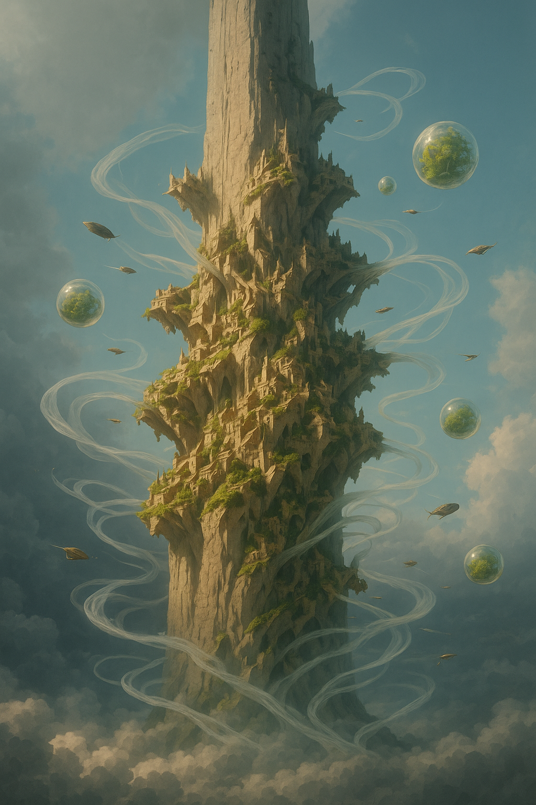

# Hypri

<!--

_Pillar City, Skyward Crown, The Spire Court_

<i>The main spire of Hypri rising above the sea of Sibannac's grass at dawn</i></img>

> _"Three powers balance on stone that defies nature; such is the way of Hypri, where belief itself shapes gravity's pull."_  
> **—Ahdom Few Proclamation, 27th year of the Current Line**

> _"Architecture begins where engineering ends."_  
> **—Walter Gropius**

  <table>
    <tr>
      <th colspan="3">Purpose Taxonomy</th>
    </tr>
    <tr>
      <td class="taxon-label">Bin:</td>
      <td class="taxon-content" colspan="2">[[Scape]]</td>
    </tr>
    <tr>
      <td class="taxon-label">Basin:</td>
      <td class="taxon-content" colspan="2">[[Sacrus]]</td>
    </tr>
    <tr>
      <td class="taxon-label">Eco:</td>
      <td class="taxon-content" colspan="2">[[Toma]] ([[Usaka]]) of [[Toman Ecoss]]</td>
    </tr>
    <tr>
      <td class="taxon-label">Kingdom:</td>
      <td class="taxon-content" colspan="2">[[Huma]]</td>
    </tr>
    <tr>
      <td class="taxon-label">Phylum:</td>
      <td class="taxon-content" colspan="2">[[Subjectivism]]</td>
    </tr>
    <tr>
      <td class="taxon-label">Class:</td>
      <td class="taxon-content" colspan="2">[[Hypri Highcourt]]</td>
    </tr>
    <tr>
      <td class="taxon-label">Order:</td>
      <td class="taxon-content" colspan="2">**Hypri**</td>
    </tr>   
    </table>

Hypri is a remarkable city-state built upon and within a single colossal spire that rises dramatically from the vast grasslands of South [[Usaka]]. This massive natural stone formation, reaching between 7,000 to 8,600 meters (23,000 to 28,200 feet) in height with an additional 500 meters (1,640 feet) of uninhabited peak above, stands as one of the most extraordinary geological features of [[Toma]]. Home to approximately 230,000 permanent residents and a fluctuating population of over 1 million traders, diplomats, and visitors, Hypri's architectural marvel comes not just from its striking silhouette against the sky but from its apparent defiance of natural laws. The gravitational fields surrounding the spire—believed locally to emanate from special ore within the stone—create a unique environment where buildings can be constructed at seemingly impossible angles, and single-person airships navigate around the towering structure along invisible currents.

As the seat of the [[Hypri Highcourt]] and home to the enigmatic [[Ahdom Few]], Hypri serves as both cultural melting pot and power nexus in western Usaka, with influence extending across the continent and beyond. While other spires exist across the southern half of Usaka, none approach the scale, complexity, or cultural significance of Hypri.

## Geography and Structure

### Venspir

Unlike the common misconception that Hypri consists of multiple spires, the city-state is built upon and within a single colossal formation that dominates the landscape, known as Venspir. This massive geological anomaly was thrust upward during what locals call the "Great Natura's Rise," but what scholars outside Hypri identify as a powerful tectonic event thousands of years ago. Venspir is composed primarily of ancient metamorphic rock with unique mineral deposits at its core.

The spire is subdivided into distinct zones that serve different functions within Hypri society:

- **Summit Zone** (8,100-8,600m/26,600-28,200ft) – The uppermost inhabitable section housing the [[Hypri Highcourt]] and administrative centers
- **Sister Domains** (7,800-8,100m/25,600-26,600ft) – Three adjacent sections converted into the personal domains of the [[Ahdom Few]]
- **Trade Belt** (7,200-7,800m/23,600-25,600ft) – A wide band circling the spire dedicated to commerce, featuring platforms for airship docking
- **Dwelling Tiers** (7,000-7,200m/23,000-23,600ft) – Multiple ring-like sections where most of the permanent population resides
- **The Splint Region** (6,800-7,300m/22,300-24,000ft) – A heavily guarded area containing the Splint, a significant crack that runs vertically through a section of the spire

### Atmospheric Retention and the Gravity Field

One of Hypri's most remarkable features is its habitable environment at elevations that would normally be uninhabitable due to thin atmosphere. At heights between 7,000 to 8,600 meters (23,000 to 28,200 feet), oxygen levels in Earth-like conditions would be insufficient to support human life, yet Hypri's residents breathe freely without assistance.

This paradox is explained by the spire's unique gravitational properties, centered on the mystical [[Ankelore]] found within the Splint. The localized gravity field not only allows for unusual architectural constructions but also:

- Creates a compressed atmospheric bubble around the spire that maintains Earth-like air pressure
- Generates weather patterns unique to the spire, including localized cloud formations and precipitation
- Establishes distinct microclimates at different elevations and facings around the spire's circumference

The precise mechanisms of these gravitational anomalies remain contentious among outside scholars. While Hypri authorities attribute them to the natural properties of the Ankelore enhanced by collective belief, scientists from [[Sol Unita]] and the [[Branches of Concordia]] propose theories involving advanced ancient technology or naturally occurring magical resonance fields.

    
Corvi's Feathermark

    
Oh, they'll tell you the spire rose from the earth in some grand, divine spectacle—the birth pangs of creation, a miracle of geological whimsy! Such delightful propaganda! The stone speaks different truths to those who know how to listen.

    
This isn't a natural formation at all, but the calcified remains of something that once stretched between worlds. Look closely at the striations in the rock face next time you visit—they don't follow geological patterns; they pulse with directionality, like massive fossilized arteries. The Dwellers know this truth in their bones, which is precisely why they worship and fear the spire in equal measure.

    
And that crack in the Splint? Not a crack at all, but a mouth slowly working its way open again after millennia. The guards aren't protecting something; they're containing it. What's more, the "atmospheric retention" they claim as a miraculous property is simply the creature breathing—holding air in its enormous lungs as it slumbers, dreaming of the day it will exhale and send us all tumbling into the abyss.

### The Splint and Ankelore

At the heart of Hypri's mysteries lies the Splint, a dramatic crack that runs from near the summit to approximately halfway down Venspir's shaft. Within this fissure lies what the Hypri Highcourt calls "Ankelore"—a [[Hollow Resource]] created through the death-process of the [[Natura]] [[Kingdom]]. This rare ore is responsible for generating the unusual gravitational fields that make Hypri's architecture, transportation systems, and atmospheric retention possible.

Ankelore is encased in a brittle mantle of pale stone known as Gravemarrow—a semi-permeable mineral that absorbs [[Anim]] (belief energy) and prevents its escape. What makes Ankelore unique among resources is that its gravitational effect cannot be predicted by mass alone; instead, the force it exerts depends on how much Anim it has absorbed, making it the only known material whose gravitational field is partially defined by conviction.

The Splint and its contained Ankelore are the most heavily guarded areas in Hypri. Visitors report that those who attempt unauthorized access appear to be "pulled" into the fissure by an unseen force, only to be escorted out later with no memory of what they witnessed inside. Official doctrine states that the Ankelore "resolves issues" with individuals by temporarily removing them from normal space-time.

The [[Ahdom Few]] claim to monitor the Ankelore's density readings daily, though some underground cults believe they actually worship it rather than safeguard it. Cultural fear exists around the possibility of over-saturation—a hypothetical event where Anim exceeds containment limits, potentially resulting in the Splint collapsing into what scholars call a "Thought Well."

### Sibannac's Carpet

Surrounding Hypri on all sides is a vast expanse of tall grass known as Sibannac's Carpet—a living entity controlled by the single soul of [[Sibannac]], one of many deities worshipped in Hypri. This carnivorous grass creates a natural defense system around the city:

- The grass grows around individuals' souls, blocking their vision while giving the impression they haven't moved far
- The environment disorients travelers without proper guides, causing them to walk in circles until exhaustion
- Those who fall asleep or die in the grass are consumed by it

A network of carefully maintained paths allows safe travel through Sibannac's Carpet, but these routes are closely guarded and frequently changed to prevent hostile forces from mapping them.

## Grow Zones and Ecological Systems

### Atmospheric Gardens

A crucial element of Hypri's self-sustainability is its extensive network of atmospheric gardens—specialized grow zones distributed throughout the spire that serve both practical and aesthetic functions. These gardens are designed to maintain oxygen levels, provide fresh food, and create living spaces that connect residents to nature despite their extreme elevation.

The three primary types of atmospheric gardens found throughout Hypri include:

#### Windflow Terraces

These open-air terraces utilize the natural airflow around the spire to cultivate specialized plants that thrive in high-altitude conditions. Wind-capturing surfaces direct air currents through dense plantings of:

- **Skyroot Ferns** – Native plants with deep anchoring systems and broad leaves that efficiently capture carbon dioxide
- **Airbloom Mosses** – Fast-growing mosses that release high volumes of oxygen when stimulated by wind
- **Drift Orchids** – Flowering plants that help filter particulates from the air while providing visual beauty

The design of these terraces incorporates aerodynamic principles to create positive pressure zones that help retain atmospheric moisture and stability. Most residential sections of Hypri include access to at least one windflow terrace, which serves as both a community gathering space and an essential component of the city's air quality management system.

#### Greenhouse Globes

Perhaps the most visually striking elements of Hypri's architecture are its greenhouse globes—spherical glass structures of varying sizes that protrude from the spire at different elevations. These pressurized environments serve as:

- Controlled cultivation spaces for food crops that couldn't survive in open-air conditions
- Botanical research facilities where new plant varieties are developed
- Cultural spaces where residents can experience environments mimicking different regions of Toma

The largest greenhouse globe, known as the "Sun Sphere," is located near the Summit Zone and spans 60 meters (197 feet) in diameter. It houses rare specimens from across the continent and serves as both a conservation center and a place of meditation for the [[Ahdom Few]].

The glass used in these structures is produced using sand exposed to the unique gravitational conditions near the Splint, resulting in a material with exceptional clarity and strength. The spherical design maximizes structural integrity while creating optimal light distribution for plant growth.

#### Embedded Root Networks

The most technically complex of Hypri's grow zones are the Embedded Root Networks—living systems integrated directly into the spire's interior. These networks consist of:

- Specialized fungi and plants grown within hollowed sections of the rock
- Hydroponic channels that distribute water and nutrients throughout the system
- Bioluminescent organisms that provide natural lighting in interior spaces

These root networks serve multiple functions beyond oxygen production:
- Natural air filtration and humidity regulation
- Structural reinforcement for interior caverns and passages
- Waste processing through mycological decomposition
- Emotional well-being for residents through connection to living systems

The development and maintenance of these networks is overseen by a specialized guild of cultivators who combine botanical knowledge with pressurization magic to sustain optimal growing conditions.

    
Corvi's Feathermark

    
The vastness of human self-deception never fails to astound me. These "grow zones" they've so carefully cultivated—these gardens suspended impossibly in the sky—are not their creation at all. They're parasites, feeding off something far older.

    
Notice how the root systems always curl toward the Splint? How the most vibrant growth occurs in chambers that align with those "random" cracks in the spire's face? That's because they're tapping into vascular networks that long predate human presence here. The spire is not dead stone but dormant flesh.

    
What they call "Embedded Root Networks" are actually the capillary systems of the ancient entity. Their "hydroponic channels" follow pathways carved by fluids that once nourished something unimaginably vast. Even the bioluminescence they so proudly display is merely the faint residual glow of a metabolic process they've inadvertently reactivated.

    
They aren't growing gardens—they're stimulating nerve endings. And one day, the creature will feel enough to wake.

### Wind Automation Systems

Hypri's engineers have developed sophisticated systems that harness the constant wind currents around the spire to power automated processes throughout the city. The most notable application is in agricultural production, where wind automation has revolutionized farming practices at high elevations.

#### Cyclone Harvesting

In traditional farming, harvest season requires significant labor for collecting and transporting crops. Hypri's cyclone harvesting system eliminates much of this work through ingenious use of controlled air currents:

1. Cultivation platforms are designed with funnel-shaped collection zones beneath crops
2. When fruits or vegetables naturally ripen and fall, or when plants are harvested, the produce drops into these collection zones
3. Directed wind currents then transport the harvested items through a network of pneumatic tubes
4. Sorting stations use differential air pressure to separate items by size, weight, and density
5. The sorted produce is delivered directly to processing facilities or distribution centers

This system reduces harvest labor by approximately 70% while minimizing bruising and damage to delicate crops. The entire process relies entirely on natural wind currents enhanced through pressurization magic, requiring no additional energy input.

#### Atmospheric Seeding

Another application of wind automation is the atmospheric seeding system, which maintains Hypri's airborne gardens:

- Specialized towers release timed bursts of seeds, spores, and beneficial microorganisms
- Wind currents distribute these materials to targeted growing areas around the spire
- Moisture-activated adhesives ensure the biological materials attach to appropriate surfaces
- Regular maintenance cycles keep the ecosystem balanced and self-renewing

This system creates the living tapestry of vegetation that adorns Hypri's exterior, with different species blossoming at different elevations and seasons to create year-round visual interest and ecological support.

#### Cultural Significance of Air Plants

Air plants hold special cultural significance in Hypri society, symbolizing the city's unique relationship with the sky and wind. The most revered varieties include:

- **Windflowers** – Delicate blooms that never touch soil, absorbing all nutrients from the air
- **Drift Moss** – Buoyant clusters that float in stable air currents around the spire
- **Sky Orchids** – Rare flowering plants that attach to the highest points of structures

Citizens often cultivate personal collections of these plants in their homes, with skilled growers achieving considerable social status. The annual Windbloom Festival celebrates these plants with displays, competitions, and the ceremonial release of propagating spores from the Summit Zone.

Religious ceremonies often incorporate air plants, particularly those honoring [[Siela Qane]] and her connection to [[Qa'ura]]. Offerings of specially cultivated specimens are considered particularly auspicious during important life transitions.

## Governance and the Ahdom Few

Hypri is ruled by the [[Hypri Highcourt]], a governing body presided over by the three serpent sisters collectively known as the [[Ahdom Few]]:

- **[[Ximena Lathen]]** – The Sea Trielder and Drakemaster of [[Lopali]], who publicly appears as Lady Athen to conceal her Concordian lineage. She rules the water-focused aspects of Hypri governance and maintains the isolated [[Imaan Plane]] of [[Heshiu]].

- **[[Jarma Konich]]** – The Land Trielder and Drakemaster of [[Kautiger]], who has formed a controversial partnership with [[Fuscia Lustin]] of the [[Chain of Delta]], creating a lucrative drug trade. She oversees territorial matters and resource management.

- **[[Siela Qane]]** – The Sky Trielder and Drakemaster of [[Qa'ura]], a devoted follower of [[Asceptim]] who works as a religious architect. She currently oversees the construction of [[Palas]], an aerial [[Imaan Plane]] dedicated to [[Asath]].

    
Corvi's Feathermark

    
The vastness of their deception is matched only by the depth of their ancestral wounds. Each sister carries a fragment of memory from the sundering of Hidraal—a psychic inheritance that drives them toward reunification while simultaneously compelling them to remain separate.

    
Their public personas—carefully constructed masks that hide their true nature—serve as both protection and prison. Ximena's rejection of her Concordian lineage isn't merely political; it's existential. The very name "Leredith" would cause molecular disruption in the carefully maintained belief field that suspends Heshiu between realities.

    
The sisters represent the three primal forces of creation: sea, land, and sky. But there should be four, shouldn't there? Where is the representative of fire, of transformation? Look to the Splint, to what pulses within that "crack," and perhaps you'll understand why they guard it so ferociously.

    
They are not rulers. They are caretakers of something far older than themselves, something that dreams beneath Hypri, something that must never fully awaken.

Each Trielder maintains authority over one of the major drakes—the [[Spawn of Hidraal]]—giving them control over powerful primordial entities. This connection to the ancient hydra [[Hidraal]] forms the spiritual and historical foundation of their rule, though this connection is not widely understood among the general population.

The Highcourt's daily operations are managed by a council of elected representatives from each spire, but final authority on all matters rests with the Ahdom Few.

## Transportation and Technology

### Gravity Manipulation

The most distinctive feature of Hypri's infrastructure is its relationship with gravity. Throughout the city, gravitational fields behave unpredictably by conventional physics. Buildings can be constructed sideways or even upside-down, with residents able to walk normally on all surfaces due to localized gravitational orientation.

This phenomenon is attributed to the gravity ore within the Splint, though the exact nature of this material is closely guarded. What makes Hypri's gravity manipulation unique is that it appears to be sustained by collective belief rather than conventional technology or natural forces. Outsiders often find that their own perception of gravity begins to align with local expectations after extended stays in the city.

### Single-Person Airships

Transportation between spires is primarily accomplished via single-person airships—lightweight, maneuverable vessels that follow invisible currents of altered gravity. These vessels require minimal propulsion, instead relying on the rider's understanding of Hypri's unique aerial pathways.

The airships typically feature:
- A small gondola for the pilot
- Minimal sail or propulsion systems
- Navigation devices attuned to Hypri's gravitational fields
- Highly personalized designs reflecting the owner's status and taste

Learning to pilot these vessels is considered a rite of passage for Hypri natives, with children beginning training around age seven. Visitors can hire pilots or attempt to navigate themselves after obtaining proper certification from the Highcourt.

### Wind Harvesting and the Vent System

Perhaps Hypri's most impressive engineering feat after its gravity manipulation is its elaborate wind harvesting infrastructure. Rather than traditional sewage systems, Hypri employs an extensive network of vents that capture the powerful air currents of the [[World Gyre]] as they flow across [[Usaka]].

These massive intake vents are positioned strategically around the outer circumference of the spire, particularly at elevations where gyre winds are strongest. The system serves multiple critical functions:

- **Power Generation** – Wind turbines within the vent network provide approximately 70% of Hypri's energy needs
- **Waste Removal** – Pressurized air channels waste from dwellings through the hollow core of the spire and out exhaust vents near the base
- **Climate Control** – Regulated airflow provides natural cooling throughout warmer months and circulates heated air during colder periods
- **Pressurization** – Maintains stable atmospheric pressure within enclosed spaces despite the city's elevation
- **Agricultural Systems** – Powers automated farming operations, seed distribution, and produce transportation

The crown jewel of this system is the Atmospheric Retention Network—a series of specialized vents and pressure chambers that work in concert with the gravity ore to maintain breathable air density throughout the inhabited sections of the spire. Without this system, the residents of Hypri would require specialized breathing apparatus or pressure suits at such extreme elevations.

The vent system's engineering brilliance lies in its exploitation of the natural pressure differentials created by the spire's height and the World Gyre's consistent flow patterns. The result is a nearly self-sustaining system that requires minimal external energy input.

However, this system does create significant waste accumulation zones at the base of the spire, particularly in areas where air currents deposit solid waste. While [[Sibannac]]'s carpet consumes much of this organic matter, large areas of non-degradable waste have formed over centuries, creating a stark contrast between the magnificent airborne city and its less pristine foundation.

### Wind Highways and Inter-Spire Travel

While Hypri itself is a single massive spire, it maintains connections to other smaller spires across southern [[Usaka]] through an ingenious system of "wind highways"—artificially maintained air corridors that neutralize or redirect the [[World Gyre]]'s natural currents. These highways allow airship travel against the otherwise prohibitive clockwise flow that dominates the [[Current Line]].

Each highway is maintained by a series of massive wind manipulation towers that create counter-currents and zones of calm, allowing pilots to navigate between destinations without fighting the gyre's natural force. The highways connect Hypri to the three other major spire cities of Usaka:

- **[[Ventari]]** – The northern central spire city, known for its scholarly institutions
- **[[Aeradyme]]** – The northwestern spire complex, famous for its artistic communities
- **[[Zephyra]]** – The western outpost city and gateway to [[Theologia]]

A particularly notable wind highway extends from Zephyra to the continent of [[Theologia]], enabling one-way travel to this narrow western landmass. However, no return highway exists due to the strength of opposing gyre currents, requiring travelers to take sea passage to [[Tayim]] to secure airship transport back to Hypri.

These wind highways are maintained through cooperative agreements between the spire cities and represent one of the region's most valuable pieces of shared infrastructure. The responsibility for their upkeep falls primarily to the [[Hypri Highcourt]], with [[Siela Qane]] overseeing most operations due to her expertise in aerial pressurization magic.

### Pressurization Magic and Outlawed Practices

Wind magic, more formally known as pressurization magic, is deeply ingrained in Hypri's culture and technological development. Practitioners manipulate air pressure to create effects ranging from small bursts of controlled wind to massive atmospheric shifts capable of altering local weather patterns.

The three members of the [[Ahdom Few]] are considered the foremost masters of pressurization magic, each specializing in a different form:

- **[[Jarma Konich]]** – Earth pressurization, manipulating solid matter through compression and decompression
- **[[Siela Qane]]** – Air pressurization, controlling gaseous elements and atmospheric conditions
- **[[Ximena Lathen]]** – Water pressurization, influencing liquid states and hydrodynamics

While pressurization magic is celebrated and widely practiced, gravity magic is strictly prohibited within Hypri. Despite this ban—or perhaps because of it—underground cults focused on gravity manipulation have emerged among younger citizens. These groups, collectively known as the [[Falling Stone Covenant]], practice forbidden techniques that directly interact with the gravity ore inside the spires.

The Hypri Highcourt maintains that tampering with the gravity stones could destabilize the entire city, potentially causing catastrophic collapse of the spire ecosystem. This conservative stance has created tension with youth movements that see gravity magic as their birthright and the next frontier in Hypri's magical development.

## Cultural Diversity and Belief Systems

Hypri is one of the most culturally diverse cities in [[Usaka]], hosting adherents of numerous religious and philosophical traditions. The native population, known as [[Dweller]]s, maintains the oldest belief systems centered around the spires themselves and [[Sibannac]].

Major belief systems include:

- **Spire Veneration** – Native Dweller practice focusing on the spiritual significance of the spires
- **Sibannac Offerings** – Ceremonial practice of casting deceased bodies from the spires as offerings to the grass deity
- **[[Gludestit]]** – Ancient worship of [[Hidraal]] maintained by some traditionalists
- **[[Asceptim]]** – Imported faith gaining popularity under [[Siela Qane]]'s influence
- **Various Nesa Devotions** – Worship of different deity-like beings

The term "Nesa" itself has Usakan origins, referring to powerful entities believed to exist beyond mortal understanding. Hypri scholars maintain extensive records of Nesa manifestations throughout history, making the city an important center for theological study.

    
Corvi's Feathermark

    
I have watched children in Hypri learn to navigate the currents between spires—tiny bodies suspended in fragile crafts, caught between terror and exhilaration. They do not understand that their successful flights depend not on their skill but on their innocence, on their unquestioning acceptance of impossibility.

    
As they age, their vessels become more elaborate, compensating for the growing doubt in their minds. By adulthood, the ships require complex mechanisms and calculations to achieve what once came naturally. The oldest pilots carry notebooks filled with arcane formulas that do nothing but quiet their disbelieving minds.

    
The children see what the adults have forgotten—the air between spires is alive with whispers from an older world. Listen carefully as you drift between towers: the sound isn't wind but breath, ancient and patient, feeding on your conviction that you won't fall.

## Economy and Resources

### The Soil Inn

The economic center of Hypri is a massive structure known as the Soil Inn—a multilevel marketplace carved into and built around one of the smaller spires. Named for a popular local poem that celebrates the fertile ground of Usaka, the Soil Inn hosts hundreds of merchants trading in goods from across Toma.

Major exports from Hypri include:

- **Cultivated Clay** – Processed by followers of [[Kautiger]] for pottery and construction
- **[[Moluk]]** – A food substance made from Kautiger's clay that doubles as a mild intoxicant
- **Gravitationally-Altered Materials** – Unique substances processed in the unusual conditions near the Splint
- **Cartographic Services** – Highly detailed maps of Usaka created by explorers who navigate Sibannac's Carpet

## Foreign Relations

### Relationship with the Chain of Delta

Hypri maintains complex diplomatic and trade relationships with the [[Chain of Delta]], particularly through [[Jarma Konich]]'s partnership with [[Fuscia Lustin]]. This arrangement has led to Hypri becoming a significant production center for substances exported to the Chain, particularly [[Moluk]], which has gained popularity as an inexpensive recreational drug.

This economic relationship has created tension with [[Siela Qane]]'s religious aspirations and [[Ximena Lathen]]'s isolationist tendencies, representing the internal conflicts among the Ahdom Few.

### Relationship with Sibannac and the Usakan Growth

Hypri's relationship with Sibannac and the Usakan Growth is defined by suspicion, fear, and cultural prejudice. While Sibannac is officially recognized as a deity and practical partner in waste management and defense, the city's government and native population—especially the Dwellers—view the lower ground and its Growthmind society as a threat to their autonomy and identity.

Hypri's media, art, and education systems are built around a narrative that positions Sibannac as both a cautionary figure and a scapegoat. In plays, children's books, and public stories, Sibannac is depicted as a beautiful, seductive woman who ultimately slaughters or enslaves those too weak to resist her. This simplification is used to empower the native population and maintain a strong sense of nationalism, especially among the small core of Dwellers who see themselves as the true guardians of Hypri's legacy.

The stories serve to unite the native population against outside influence, particularly from the much larger and more empathetic Usakan Growth society below. While many traders and visitors pass through Hypri for commerce, the city's core identity is fiercely protected by these narratives. The message is clear: only the strong-willed and loyal can resist Sibannac's allure and preserve Hypri's independence.

In reality, Sibannac does not kill those who are weak; instead, she allows them to fade within her societies. In the Usakan Growth, one's [[Will]] is heavily decayed, but life is good from a communal and cultural standpoint. Disease is a risk for those who do not wear protective clothing, as waste is used as fertilizer and recycled into infrastructure and technology. The contrast between Hypri's nationalist myth and the lived reality of the Growthmind below is a source of ongoing tension and misunderstanding.

## Historical Connections

### Hidraal and the Spawn

Though not commonly known among average citizens, Hypri's ruling class maintains knowledge of the city's connection to [[Hidraal]], the ancient three-headed hydra who once dominated the region through the [[Gludestit]] belief system. After Hidraal's beheading, her three heads became the primordial serpents now known as the [[Spawn of Hidraal]]:

- [[Lopali]] – The Serpent Ray, a Ferra-Water Natura hybrid controlled by Ximena Lathen
- [[Kautiger]] – The Oedipwyrm, a multi-headed Ground Natura-Celia hybrid controlled by Jarma Konich
- [[Qa'ura]] – The Amphiptere serpent with crystalline features controlled by Siela Qane

Some scholars have theorized connections between the Ankelore in the Splint and the ancient Hidraal, suggesting the fissure might be a wound left from the primordial conflict that resulted in Hidraal's beheading. While the Highcourt officially dismisses such claims, the close guarding of the Splint and the obsessive monitoring of the Ankelore lend credence to the notion that the resource may have deeper significance than publicly acknowledged.

A fourth entity, [[Hathakrik]], represents Hidraal's regrown body but resides in the separate realm of [[Dar]] rather than Toma.

The Ahdom Few's true ambition—kept secret from all but their closest confidants—is the eventual reunification of these serpents to restore [[Gludestit]] and liberate primordials from [[Hoard Sickness]], though each sister has different visions of how this should be accomplished.

## Images

<i>Single-person airships navigating between Hypri's spires</i></img>

<i>The edge of Sibannac's Carpet seen from one of Hypri's lower platforms</i></img>

## Inspiration

Hypri draws inspiration from various sources, including:
- Floating mountains of Pandora (Avatar)
- M.C. Escher's gravity-defying architectural illustrations
- Japanese pilgrimage mountains
- Cappadocia's fairy chimneys and cave dwellings
- Persian tower tombs

## Related Wiki Pages

- [[Usaka]]
- [[Ahdom Few]]
- [[Hypri Highcourt]]
- [[Hidraal]]
- [[Spawn of Hidraal]]
- [[Sibannac]]
- [[Ximena Lathen]]
- [[Jarma Konich]]
- [[Siela Qane]]
- [[Lopali]]
- [[Kautiger]]
- [[Qa'ura]]

-->