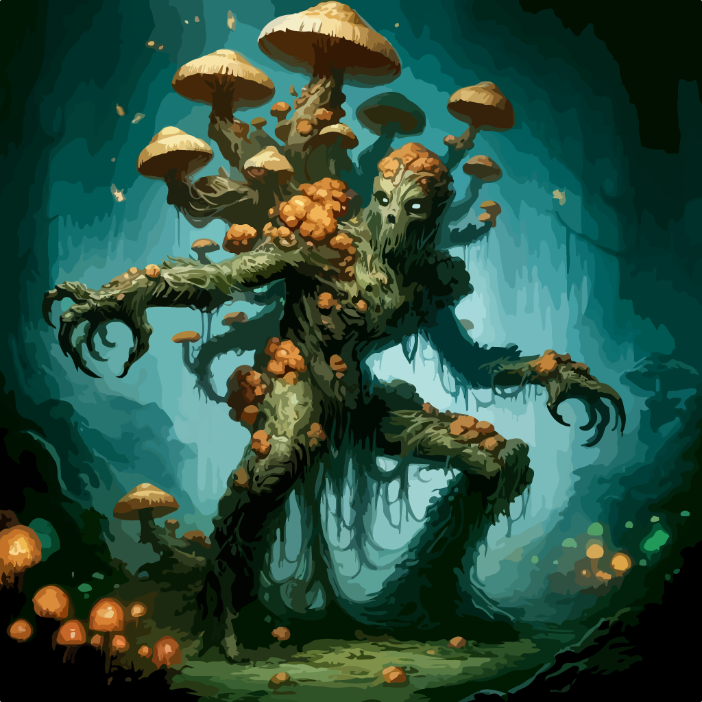

<!-- wiki-header-section:start -->
# Inoculation

<i></i></img>

Inoculation is the process by which Chantae's influence spreads to other creatures, measured by the Spore Score. As a creature's Spore Score increases, they experience Spore Delusions and, at 100, become fully turned (Reborn) and act according to Chantae's will. Inoculation is a key mechanism for Celia expansion and the spread of Mycelism.

<!-- wiki-header-section:end -->

<!-- taxonomy-table-section:start -->

  <table>
    <tr>
      <th colspan="3">Purpose Taxonomy</th>
    </tr>
    <tr>
      <td class="taxon-label">Bin:</td>
      <td class="taxon-content" colspan="2">[[Scape]]</td>
    </tr>
    <tr>
      <td class="taxon-label">Basin:</td>
      <td class="taxon-content" colspan="2">[[Sacrus]]</td>
    </tr>
    <tr>
      <td class="taxon-label">Kingdom:</td>
      <td class="taxon-content" colspan="2">[[Celia]]</td>
    </tr>
  </table>

<!-- taxonomy-table-section:end -->

## Spore Score and Delusions
- **Spore Score (0-100):** At 100, a creature is fully turned by Chantae. Celia damage or environmental effects increase this score. Constitution saving throws can resist it. At 100, the player must follow DM suggestions as Chantae's will.
- **Spore Delusions:** At 60-100, a character experiences delusions, growing in severity. At 100, delusions are indistinguishable from reality.

## Images
<i>Visualization of a mind succumbing to spore delusions.</i></img>

## Related Wiki Pages
- [[Celia]]
- [[Spore Score]]
- [[Reborn]]
- [[Chantae]]

<!-- not-for-live-publishing:start -->
<!-- obsidian-pull:start -->
### Spore Score

 0-100, at 100 the player becomes turned by Chantae. Celia Damage or Celia related environmental effects can cause this to stack on victims. Constitution influences how well the player is at warding it off through a constitution saving throw. The player who is turned can still play the game (if they chose), but must listen to suggestions from the DM for their course of actions.

### Spore Delusions

  Spore Delusion is a mental illness caused by a creature’s Spore Score being within the 60-100 range. A character experiences major delusions, almost like a genjutsu, that is explained to the player throughout the game as if they were normal. The severity of this sickness depends where, within the range, the creature is. This sickness is essentially Chantae gaining a grip on the creature. Once a character reaches 100, these delusions are indistinguishable from reality and the character must play into them.

  

<!-- obsidian-pull:end -->
<!-- not-for-live-publishing:end -->