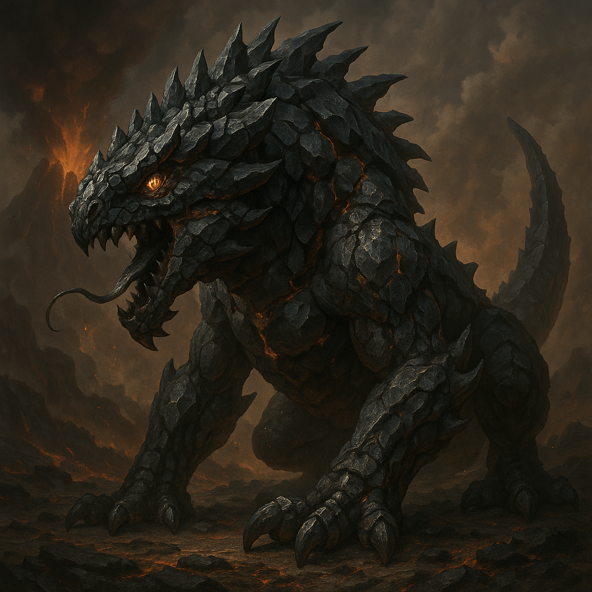

 <!-- wiki-header-section:start -->
# Kingdom

<i>The [[Grokauw]], a [[Ferra]]-[[Natura]] [[Resonant]] from the volcanic continent of [[Kro'Tan]], this obsidian-plated titan embodies raw consumption and elemental fury. Forged in magma and instinct, the Grokauw stalks the scorched ridges as both predator and volcanic omen.</i></img>

A **Kingdom** within Toma represents one of many large belief groups on the plane, defined by groups of living creatures with a common biological, characteristic, or planar function, which is thought to be linked to a greater universal purpose, known in [[Purpose Taxonomy]] as the [[Empire Function]]. These functions encompass philosophical and cosmological ideas such as creation, destruction, management, counterweight, dichotomy, rebirth, etc, with each kingdom contributing to the power dynamics and total balance present in Toma.

<!-- wiki-header-section:end -->

<h3>Organizers of Belief</h3>

All creatures in Toma must be thought of as capable of organizing under belief systems. This means that animals and plants can display distinct behavior based upon ideology surrounding their empire function. This may be seen as faith, governance, territoriality, hunting patterns, and other pathological behaviors which act around the belief system. Therefore, a creature's behavior ultimately pinpoints itself unto that purpose and ideology answers the question of "how?" with the empire function being the "what?".

The capacity for belief organization varies significantly across kingdoms based on their intelligence classifications, which exist on a spectrum:

**Simple-minded kingdoms** are more likely to unite under a single, cohesive belief system due to their straightforward cognitive structures. These kingdoms tend to exhibit uniform behaviors and responses across their populations.

**Complex-minded kingdoms** (or "Comple-minded") display diverse and often contradictory belief systems within their populations. Their advanced cognitive abilities lead to philosophical debates, competing ideologies, and fragmented belief structures. [[Huma]] consider themselves complex-minded within Toma, which explains their disarrayed organization of belief compared to other kingdoms.

**Middle-minded kingdoms** fall between these extremes, capable of sophisticated belief systems but with enough cognitive unity to maintain more coherent ideological structures than complex-minded kingdoms.

These classifications exist on a spectrum based on the statistical organization of belief for each member of the kingdom population. For example, [[Celia]] exhibit a mass hivemind belief system called [[Mycelism]], representing a simple-minded approach to belief organization. One notable example is the [[Chant]] (pronounced "shaunt") subcelia, the largest and most widely-dispersed population in the Celia kingdom, which display distinct traits to spread their hivemind mycelium's ideology.

<h3>Kingdoms of Toma</h3>

The following list includes every kingdom of Toma, including those that are proposed and accepted in only certain belief systems:

- [[Nesa]] (God or Deity) (**Contested**)
- [[Automata]] (Construct) (**Contested**)
- [[Bluma]] (Plant and Chromista)
- [[Celia]] (Fungi and claims some bacterial roles) (**Contested**)
- [[Decara]] (Archaea and Bacteria) (**Contested**)
- [[Ferra]] (Animal)
- [[Huma]] (Humanoid)
- [[Monstra]] (Monster)
- [[Natura]] (Elemental)
- [[Spira]] (Spirit)
- [[Resonant]] (Multiple Kingdoms)

The **Proto** kingdom served as the foundation for the evolution of the Bluma and Decara kingdoms, but is no longer included in the newest accepted model of the [[Astalt's Theory of Kingdoms|Theory of Kingdoms]].

<h3>Empire Function</h3>

Each kingdom within Toma organizes around a purpose or Empire Function. Here is a list of each kingdom's purpose, including contested claims.

- [[Nesa]] (Management, Dichotomy, or ???) (**Contested**)
- [[Automata]] (Freedom (Replace Huma), Execution or ???) (**Contested**)
- [[Bluma]] (Production)
- [[Celia]] (Rebirth or Transmutation) (**Contested**)
- [[Decara]] (Destruction)
- [[Ferra]] (Consumption)
- [[Huma]] (Curiosity, Freedom, Ascension, or ???) (**Contested**)
- [[Monstra]] (Suppression)
- [[Natura]] (Protection)
- [[Spira]] (Allowance, Energy, Magic, or ???) (**Contested**)
- [[Resonant]] (Multiple Kingdoms)

<h3>Astalt's Theory of Kingdoms</h3>

[[Astalt's Theory of Kingdoms]] aims to unite the current understanding of the kingdoms with that of the constantly-evolving [[Purpose Taxonomy]]. Within this theory, the kingdoms are further organized into deeper hierarchies, seen as webs of interplay between the kingdoms given the defined, and well observed, empire functions already known. 

<h3>Subkingdoms</h3>

Kingdoms may have subkingdoms, or variations and subraces that fit within the empire function. The prefix "sub-" is used to denote populations within a kingdom. As an example of this, a Dwarf would be considered a subhuma, as would a human.

