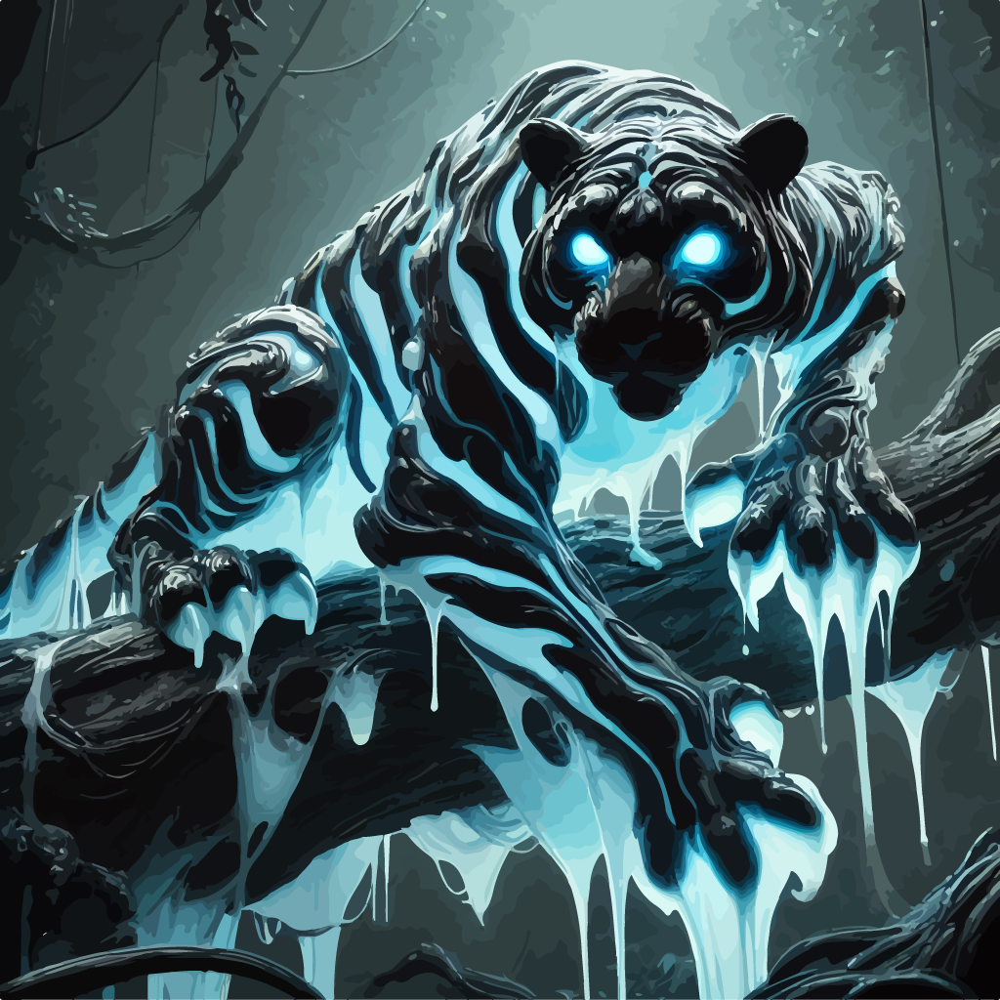
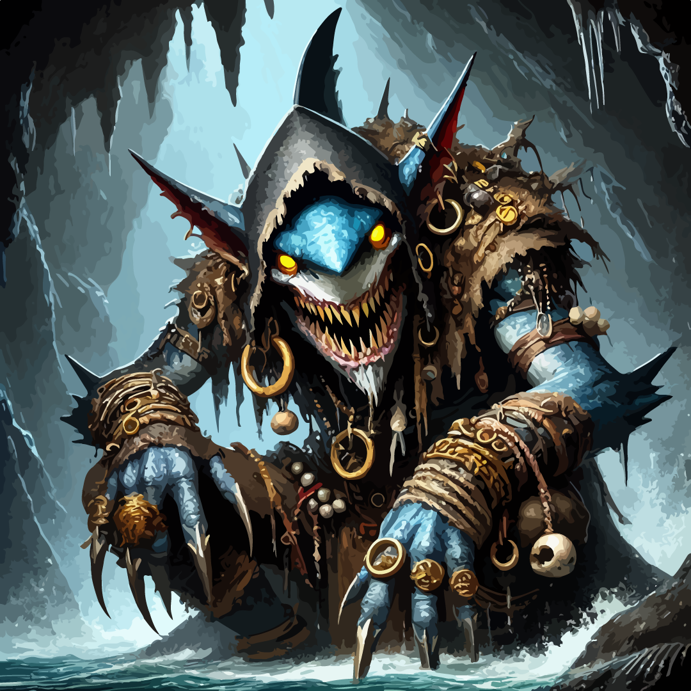

# Lavinho

<i>Awaiting character art</i></a>

**Eco:** [[Toma]]  

**Race:** Human (([[Tayiman]]))  
**Class:** Rogue  
**Subclass:** Swashbuckler  
**Starting Level**: 3  

**Starting Age:** 

 

Lavinho is a character in [[Whisper of the Well]], the first campaign of Toma.

## Starting Location

You will start the game pulling into the [[Lauderdocks]], the largest open dock of [[Scender|Scender's]] [[Southcatch|Southcatch Bay]], just north of the eco-renowned [[Asath Sanctuary]]. You will arrive on a sloop jointly-owned by you and [[Vankner]], a finely-dressed merchant that is incredibly skilled in [[Monstra]] negotiation. Vankner often finds himself in very dangerous situations, primarily amongst [[Goblin|Goblins]] and [[Orc|Orcs]], but the tongue remains his most powerful weapon as he facilitates the trade of exotic goods between even the most unlikely of business associates. Although an independent merchant, he also works in brokerage which incentivizes his partnership with the Hacienda Band. Vankner tends to take his job very seriously and only truly laughs on rare occasion, not including the times where he feigns laughter in an attempt to situate himself within reach of a new job offer. 
 
 

<i></i></img>  

The sloop, navigated by Vankner and your aid aloft (climbing and working on masts of the ship), will be carrying a smuggled [[Malgasta]] from a seller in the [[Agresta Jungle]] of eastern [[Sancta]]. This Malgasta is said to be worth around 7,500 gold pieces depending on his condition upon delivery. 
 
 

<i>The Malgasta you and Vankner retrieved from a seller in the Agresta Jungle.</i></img> 

You will suggest to take a quick stop at Scender for supplies before heading to the dropoff point east-northeast of Southcatch. This dropoff point is called [[Bobit]], which is a society of Goblins situated within a sheer cliffside ravine not far from Scender. This decision will take you past the drop-off point, only to go against the Swirling Sea's currents to navigate to this cliffside. This may sound like a bad decision, but in fact the dropoff point is not very far from Scender's coast and it would only be about thirty minutes out of the way. Besides, before talking to Goblins it is always good to stock up. Wouldn't want to show up empty handed. Vankner disagrees, as he feels he has all the necessary tools to manage the negotiation. However, his wealth and reputation sets you apart from him, thus the difference of opinion. I will

**When first given the chance you speak, you should remind Vankner of who you are expected to meet. He will hesitate to rebut, then give in to the request. This is because you will be expected to negotiate with your dropoff contact:**
 

<b>Flanks, the Shiver Prince.</b></img>  

Upon docking at Scender, he will leave a promissory note for you to give to a merchant for supplies. He will then leave without warning.

At any point, you may return to the boat and tamper with the crate, which will be closed and covered by a cloth. There will be a mechanical contraption used to control visibility inside the crate. It can either be fenced or completely shut in, with reinforced metal sheets extending from the jail bars like countless closing doors or windows. Perhaps, you will become curious about seeing the creature while waiting for Vankner to return, since you have actually never seen it, although Vankner has. When you do this, it will allow a portion of the Malgasta to seep out of an undisclosed opening (covered by the cloth) and run out. You will notice this and the game will begin there.  

## Badaba, Hacienda Band, Tayim Trade Republic

You are a Tayiman Human, a Toman lineage of Human and the [[Huma]] [[Kingdom]].

<i>Tayiman does not mean that you were born within the [[Tayim Trade Republic]]. Instead, it means that you come from the lineage of Huma that escaped [[Endem]], the subterrain of Toma, during the [[Line from Few]].</i>

You hail from [[New Badaba]], a coastal city built on the flooded ruins of [[Old Badaba]], which was destroyed by the [[Tayim Trade Republic]] during the [[Battle of the Banquet]]. New Badaba is located on the Isle of [[Babadoo Slim]], known for its lush jungles, dangerous fauna, and bountiful crops. Though publicly maintaining an agricultural face, the city’s true power lies in its clandestine trade of exotic creatures, most notably [[Primordial|Primordials]], and its history of piracy and rebellion.

The ruling class of New Badaba is the [[Hacienda Band]]—a group of landowners and merchants who present themselves as legitimate stewards of the city’s agriculture but covertly profit from black-market activities. They broker deals involving rare beasts, leverage the region’s piracy networks, and maintain a delicate balance between ordinary citizens and unsanctioned trade. Their grip on local governance keeps New Badaba independent from external powers and fosters a deep-seated mistrust of the Tayim Trade Republic.

The Tayim Trade Republic itself was once an expansive empire that imposed its cultural and economic influence across Babadoo Slim. Their destruction of Old Badaba was a harsh response to rebellion and perceived threats to their colonial power. The lingering resentment in New Badaba comes not only from the lives lost and the city razed but also from the perceived ideological suppression they felt. This history fuels the enduring determination of the Hacienda Band—and many others on the isle—to remain free from the Republic’s grasp, even as whispers of more primal beliefs continue to shape the city’s cultural and spiritual backbone.

## Ideologies of the Southwest

*The section below is going to be quite complex, but I decided to add it anyways. Your character 'could' know the basic information about these things depending on your preference. Of course, history checks will be quite common in this campaign, so I don't expect you to know any of this. Two faiths, Pria and Gludestit*

### Primalism and Advancism

**Simi are Huma-Ferra Resonants.** 
**Primalism and Advancism are two contrasting beliefs sprouting from Huma-Ferra Resonance.** 
**Anthros, Ferra with Huma mutations, want to advance.**  
**Zothros, Huma with Ferra mutations, want to return to nature.** 

[[Primalism]] and [[Advancism]] are two political and cultural ideologies that arose during an early evolutionary phase of [[Huma]]. As Huma and [[Ferra]] gradually evolved into [[Anthros]] (Ferra with Huma-like traits) and [[Zothros]] (Huma with Ferra-like traits), these ideologies reflected the new consciousness that emerged.

- **Primalism**: Emphasizes a return to primal ways, mostly held by Zothros species. Believers seek to reconnect with nature, viewing it as the only path to true harmony.  
- **Advancism**: Focuses on the progression of intelligence and society, typically held by Anthros species. Believers seek to limit nature’s suffering by expanding civilization thoughtfully, though this can lead to a clash with Primalism’s more nature-centered ethos.

The [[Simi]], a subkingdom of simian [[Anthros]], often find themselves caught between these ideologies. New World Simi, with their intelligence and structured communities, tend to lean toward advancist or expansionist cultures, while Old World Simi embody more primal instincts. Both, however, reflect the broader struggles of Babadoo Slim.

### Innerdualism

**Innerdualism is an nomadic belief system from the early days of the Line from Few.**

[[Innerdualism]] is a meditative belief devoted to worship of the [[In-between]] and the creator-figure called [[Albumaiyhet]]. Followers strive for absolute neutrality of mind, believing that by attaining an inner stillness, they can pass between reality and the [[Soul Fields]] to commune with higher beings known as [[Spira]] and [[Nesa]]. The faithful, referred to as [[Walkers of Duality]], refer to Albumaiyhet as “The Mean,” symbolizing a perfect balance without extremism.

### Asceptim

**Asceptim is a sanctan Huma faith that has been explored previously.**

[[Asceptim]] is the faith of [[Sol Unita]], centering on the pursuit of [[Sol Proscima]]: a state of ultimate enlightenment and fulfillment. Using the metaphor of sunlight evaporating water, Asceptim teaches that creatures (the water) can ascend (evaporate) toward a divine realm (the sun). This notion of ascension coincidentally mirrors Advancism’s push for expansion—where both see a future of transcendence, albeit in different ways: one spiritual and one societal.

### Ashprahm and Anosdi

**Ashprahm and Anosdi are contrasting belief systems sprouting from Primalism and Advancism beliefs**

[[Ashprahm]] is a belief system rooted in Primalism and [[Innerdualism]], emphasizing harmony with nature’s core essence through ritual and spiritual cleansing. It rejects technological progress in favor of a more primal existence guided by balance. On [[Babadoo Slim]], [[Oshe]] is the only surviving subphylum of Ashprahm, blending occult practices with naturalistic reverence.  

[[Anosdi]], in contrast, is a subphylum of Advancism and Asceptim. It venerates [[Asath]], the Eye, as the sole creator, and actively promotes expansion, believing that all progress is deserved for those who seek it. Where Ashprahm implores a return to balanced primal forces, Anosdi encourages the forward march of society under the banner of Asath.

### Gludestit and Onend

**Gludestit is a dying Ferra phylum and Onend is replacing it.**

[[Gludestit]] was once a powerful phylum of [[Ferra]] belief in [[Hidraal]], an ancient prophetic hydra, centering on the inconsiderate hoarding of resources and power. Gludestit taught that survival depended on controlling both natural and spiritual wealth, leading to cannibalistic practices and a culture of absorption. Although in decline, Gludestit’s philosophy of accumulation still echoes in certain pockets of pirates and Primordials who recall Hidraal’s promise of rising again.

It is important to know that Ferra, as low-minded creatures, tend to follow simpler belief systems. Belief in Hidraal under Gludestit was an example of this during the [[Line from Few]]. Consequently, the strongest primordials linger from the times of her reign, laying claim to land as biological remnants. In the current line, all true Ferra follow two gods, [[Apex and Praeda]]. This belief system is referred to as [[Onend]] by Huma and resonant scholars.

### Pria, Oshe, and the Simi

**Pria and Oshe are subphylums are found in Babadoo Slim.**  

[[Pria]] is a subphylum of Gludestit that arose in direct opposition to the Tayim Trade Republic’s advancist tendencies. Pria’s followers work alongside nature rather than trying to dominate it, believing life and death to be two sides of the same coin. The tension between Primalism and Advancism helped spark the [[Battle of the Banquet]], during which Old Badaba fell. For many in [[New Badaba]], Pria stands as both a rebellious outcry against oppressive rule and a guiding spiritual presence that helped them rebuild. 

[[Oshe]], meanwhile, is a mystical subphylum of Ashprahm practiced in secrecy on Babadoo Slim—particularly in New Badaba. Focusing on ritual invocation and interaction with spirits, Oshe’s followers preserve a more occult aspect of Toma’s primal spirituality. While Pria rebels against external domination, Oshe delves into hidden rites, harnessing the energies of both nature and the supernatural.

## World Gyre, Swirling Sea, Arkon

The [[World Gyre]] is a phenomenon that causes an outward and spiraling push of energy from Toma's center, known as the continent of [[Arkon]]. This natural occurrence is what causes the great [[Swirling Sea]] to spiral and for winds to do the same. This is important for a swashbuckler to know, as it heavily influences the transportation of goods and people. 

Arkon, at the center of the Swirling Sea, is a staple question of life in Toma. The great island is notorious for its fables and disputes. Although, in the current line, there is a eco-agreement, decided upon by many (not all) powerful political leaders. No creature shall enter the continent from outside due to the mental overstimulation and reality distortion entering can cause. It is said that many have died trying to enter, draining their sanity with each step and memory they lose.

## Additional Notes

- You may wield a cutlass, which is a rapier but with slashing damage instead of piercing damage.
- Deus ex machina faith (Possible Development)
- Return of Malgasta to Hacienda Band Contact (Possible reward of about 3000g)

