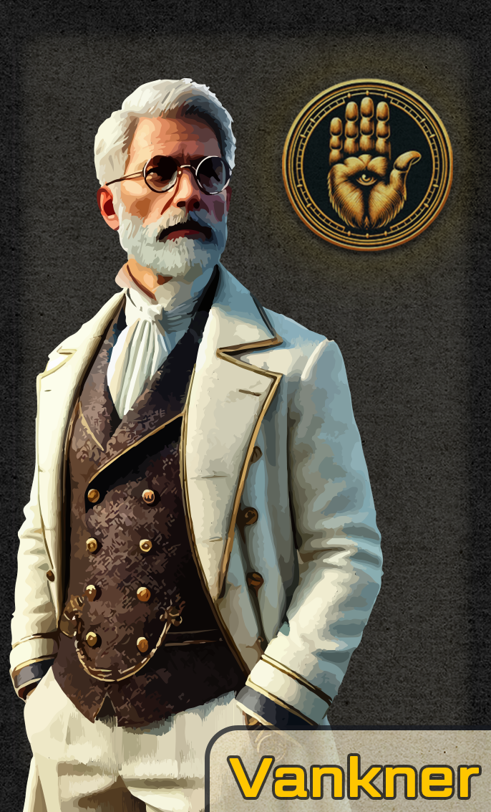

# Lavinho

<i>Awaiting character art</i></a>

**Eco:** [[Toma]]  
**

**Race:** Human  
**Class:** Rogue  
**Subclass:** Swashbuckler  
**Starting Level**: 3  
 

Lavinho is a character in [[Whisper of the Well]], the first campaign of Toma.

## Starting Information

### Starting Location

You will start the game pulling into the [[Lauderdocks]], the largest open dock of [[Scender|Scender's]] [[Southcatch|Southcatch Bay]], just north of the eco-renowned [[Asath Sanctuary]]. You will arrive on a sloop jointly-owned by you and [[Vankner]], a finely-dressed merchant that is incredibly skilled in [[Monstra]] negotiation. Vankner often finds himself in very dangerous situations, primarily amongst [[Goblin|Goblins]] and [[Orc|Orcs]], but the tongue remains his most powerful weapon as he facilitates the trade of exotic goods between even the most unlikely of business associates. Although an independent merchant, he also works in brokerage which incentivizes his partnership with the Hacienda Band. Vankner tends to take his job very seriously and only truly laughs on rare occasion, not including the times where he feigns laughter in an attempt to situate himself within reach of a new job offer.

The sloop, navigated by Vankner and your aid aloft (climbing and working on masts of the ship), will be carrying a smuggled [[Malgasta]] from a seller in the [[Agresta Jungle]] of eastern [[Sancta]]. This Malgasta is said to be worth around 6,800 gold pieces depending on his condition upon return. 

<i>The Malgasta you and Vankner retrieved from a seller in the Agresta Jungle.</i></img>

I am thinking that Vanker will desert you once he understands that you lost the Malgasta.

<i>An image of Vankner.</i></img>

Either you or the Vankner will suggest to take a quick stop at Scender for supplies before heading to the dropoff point east-northeast of Southcatch. This decision will take you past the drop-off point, only to go against the Swirling Sea's currents to the north-northeast. This may sound like a bad decision, but in fact the dropoff point is not very far from Scender's coast and it would only be about thirty minutes out of the way. Besides, before talking to Goblins it is always good to stock up. Wouldn't want to show up empty handed.

*Determine whether you would like it to be you or Vankner who makes this call.*

*Optionally, we can choose to work on another start if you do not like this one.*

## World Gyre, Swirling Sea, Arkon

The [[World Gyre]] is a phenomenon that causes an outward and spiraling push of energy from Toma's center, known as the continent of [[Arkon]]. This natural occurrence is what causes the great [[Swirling Sea]] to spiral and for winds to do the same. 

Arkon, at the center of the Swirling Sea, is a staple question of life in Toma. The great island is notorious for its fables and disputes. Although, in the current line, there is a eco-agreement, decided upon by many (not all) powerful political leaders. No creature shall enter the continent from outside due to the mental overstimulation and reality distortion entering can cause. It is said that many have died trying to enter, draining their sanity with each step and memory they lose.

## Additional Notes

- You may wield a cutlass, which is a rapier but with slashing damage instead of piercing damage.
