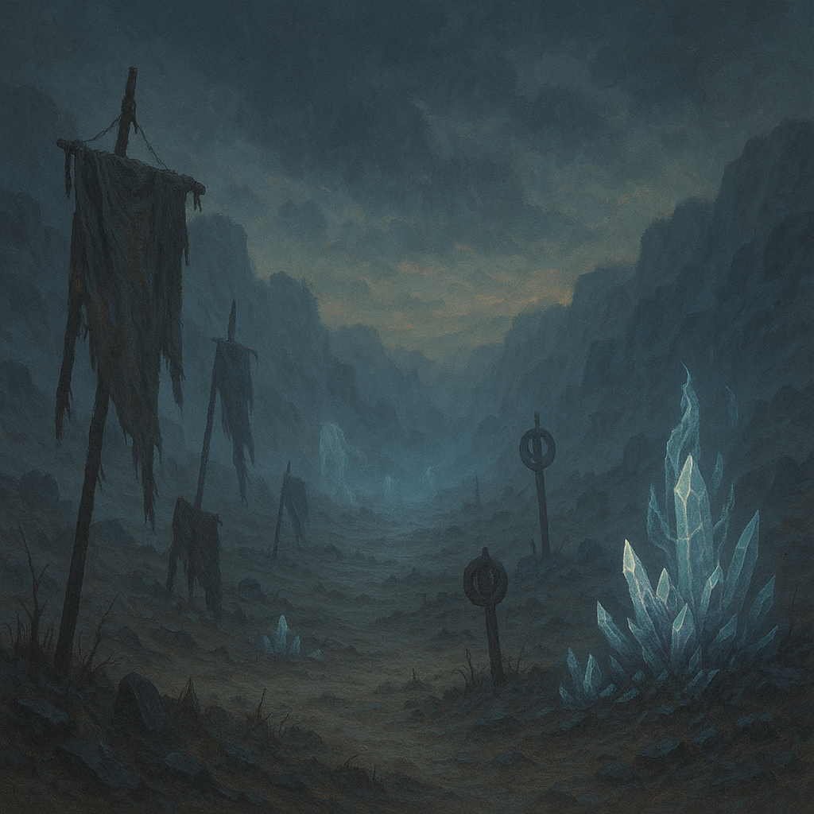

<!-- wiki-header-section:start -->
# Metageography

<i>Valley of the Forgotten, off the coast of Norfbrayke, Wyldere.</i></img>

<blockquote class="wiki-quote">
    _"Too, the land is haunted by death."_  
    —Siever Lusitan, Viceroy of the Necesse Sanct
</blockquote>

Metageography is the study and understanding of how Toma's physical and metaphysical landscapes are shaped by the processes of death, anim release, and collective belief. Unlike traditional geography, which focuses on physical forces, metageography recognizes that the biomes, resources, and even the climate of Toma are products of both natural and ideological transformations. The formation of [[Hollow Resources]] is a direct result of these processes, as the deaths of populations or the decay of belief systems leave behind potent materials that define the future of civilizations.
<!-- wiki-header-section:end -->

<!-- taxonomy-table-section:start -->

  <table>
    <tr>
      <th colspan="3">Purpose Taxonomy</th>
    </tr>
    <tr>
      <td class="taxon-label">Bin:</td>
      <td class="taxon-content" colspan="2">[[Scape]]</td>
    </tr>
    <tr>
      <td class="taxon-label">Basin:</td>
      <td class="taxon-content" colspan="2">[[Sacrus]]</td>
    </tr>
    <tr>
      <td class="taxon-label">Eco:</td>
      <td class="taxon-content" colspan="2">[[Toma]] of [[Toman Ecoss]]</td>
    </tr>
  </table>

<!-- taxonomy-table-section:end -->

## Metageography in Toma

Metageography explains why Toma's environments are so extreme and varied. When a population undergoes a Mixture or Solution Death, the anim released does not simply dissipate; it imprints upon the land, altering its properties and sometimes giving rise to new biomes or phenomena. The [[Wasting Event|Wasting Events]] are prime examples, where mass deaths reshape entire regions. The resulting [[Hollow Resources]] become the foundation for new civilizations, technologies, and spiritual practices.

## Relationship to Hollow Resources

The study of metageography is inseparable from the study of [[Hollow Resources]]. By understanding the circumstances and beliefs surrounding a death event, scholars can predict the type and potency of resources that will emerge. This knowledge is crucial for those seeking to harness Toma's most valuable materials.

## See Also

- [[Hollow Resources]]
- [[Toma]]
- [[Anim]]
- [[Wasting Event]]
