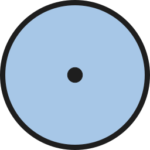

# Purpose Taxonomy

**Purpose Taxonomy** is a classification system designed to organize life by its connected belief structures and destinies across the universe. It arranges existence into a vertical hierarchy of taxons—ranging from the grand scale of the universe down to the singular soul’s purpose—that define everything from geography and government to faith and dimension. 

At the core of this system is the recognition that every soul possesses a unique, quantized vision for the future—its intrinsic signature, termed **Kind (K, <, or >)**. This vision is considered static until it is set into motion. The dynamic aspect—the rate at which that vision is realized in the world—is called **Degree (D or ^)**. In short:

> **Degree = Kind’s Rate of Actualization**

This interplay between the fixed vision and its actualization ultimately defines the soul’s realized destiny, or **Essa**. 

### Taxonomic Ranks

Purpose Taxonomy comprises nine hierarchical ranks:

1. **Bin:** Universe
2. **Basin:** Dimension
3. **Eco:** Plane
4. **Kingdom:** Inhabitant (by Empire Function)
5. **Phylum:** Ideology
6. **Class:** Government
7. **Order:** Civilization
8. **Family:** Community
9. **Essa:** Soul’s Purpose

### Creation and Evolution

- **Creation:**  
    Estimated to be conceived during the [[Taxotheir Line|Taxotheir Line]] by the Huma of Toma, Purpose Taxonomy was developed to interpret the complex interplay of [[Evolution]], [[Belief]], and [[Anim]] in the Toman Ecoss. Although, it should be known that some argue that the system was initially designed as a common (in relation to interspecies unification), albeit lightweight, language describing one's connection to their environment. This theory posits that the hierarchy was constructed to allow creatures of different types to communicate simple ideas to one another without having to engage in each other's complex languages.
    
- **Social Taxonomy:**  
    Revised during the [[Line from Few]] after the [[Cel Blindbirth Line]], Purpose Taxonomy now exists in two forms:
    
    1. **Taxotheir, T.L., or Social Taxonomy** – pre-Blindbirth understanding
    2. **Current or C.L. Taxonomy** – reflective of the contemporary timeline
    
    

### Classification Example

<!-- taxonomy-table-section:start -->

  <table>
    <tr>
      <th colspan="3">Purpose Taxonomy</th>
    </tr>
    <tr>
      <td class="taxon-label">Bin:</td>
      <td class="taxon-content" colspan="2">[[Ex. Bin]]</td>
    </tr>
    <tr>
      <td class="taxon-label">Basin:</td>
      <td class="taxon-content" colspan="2">[[Ex. Basin]]</td>
    </tr>
    <tr>
      <td class="taxon-label">Eco:</td>
      <td class="taxon-content" colspan="2">[[Ex. Eco]] ([[Ex. Continent]], [[Ex. Region]], [[Ex. Continent]]) of [[Ex. Ecoss]]</td>
    </tr>
    <tr>
      <td class="taxon-label">Kingdom:</td>
      <td class="taxon-content" colspan="2">[[Ex. Kingdom 1]] and [[Ex. Kingdom 2]]</td>
    </tr>
    <tr>
      <td class="taxon-label">Phylum:</td>
      <td class="taxon-content" colspan="2">[[Ex. Phylum]]</td>
    </tr>
    <tr>
      <td class="taxon-label">Class:</td>
      <td class="taxon-content" colspan="2">[[Ex. Class]]</td>
    </tr>
    <tr>
      <td class="taxon-label">Order:</td>
      <td class="taxon-content" colspan="2">[[Ex. Order]]</td>
    </tr>
    <tr>
      <td class="taxon-label">Family:</td>
      <td class="taxon-content" colspan="2">[[Ex. Family]]</td>
    </tr>
    <tr>
      <td class="taxon-label">Essa:</td>
      <td class="taxon-content" colspan="2">[[Ex. Essa]]</td>
    </tr>
  </table>

<!-- taxonomy-table-section:end -->

### Exception-Branching

When a creature does not neatly fit a taxon category, its classification is marked as "EB" (Exception-Branching). For example, a human fighter following a unique religious philosophy might be designated "EB" until further evidence supports a more standard categorization, or it branches into its own categorization. This could also be understood with the idea of a forming government, which may or may not develop into a state of uniqueness.

