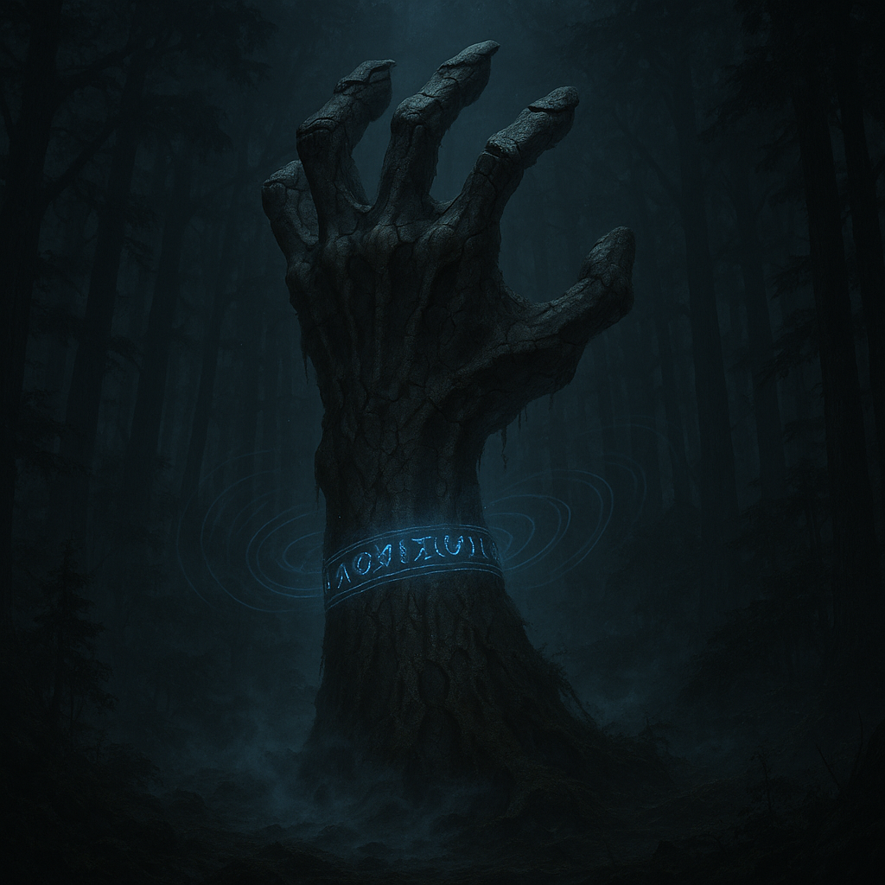

o<!-- wiki-header-section:start -->
# Sevfres
_Exhuma ([[Tildohsi Partition]])_
</img>

**Sevfres**, locally known as Exhuma, is a powerful and enigmatic entity bound within the depths of the [[Clutched Forest]]. A [[Decara|Decaran]] [[Huma]] [[Mimid]], Sevfres was trapped in the forest through a sacrificial [[Source Surge]]. The people of [[Tildohsi]] and the [[Tildohsi Partition]] have survived in the shadow of Sevfres by mastering deception and sound-masking magic, using these techniques to hide from the hand’s relentless search. While Sevfres is a constant threat, its presence also provides a form of indirect protection for the city, as its power deters outside invaders.
<!-- wiki-header-section:end -->

<!-- taxonomy-table-section:start -->

  <table>
    <tr>
      <th colspan="3">Purpose Taxonomy</th>
    </tr>
    <tr>
      <td class="taxon-label">Bin:</td>
      <td class="taxon-content" colspan="2">[[Scape]]</td>
    </tr>
    <tr>
      <td class="taxon-label">Basin:</td>
      <td class="taxon-content" colspan="2">[[Sacrus]]</td>
    </tr>
    <tr>
      <td class="taxon-label">Eco:</td>
      <td class="taxon-content" colspan="2">[[Toma]] ([[Wyldere]], [[Clutched Forest]]) of [[Toman Ecoss]]</td>
    </tr>
    <tr>
      <td class="taxon-label">Kingdom:</td>
      <td class="taxon-content" colspan="2">[[Decara]] ([[Huma]] [[Mimid]])</td>
    </tr>
  </table>

<!-- taxonomy-table-section:end -->

## Main Section

**Sevfres** is a being of immense destructive power, its form manifesting as a hand and wrist portion reaching out of the soil, forever seeking and grasping for souls within the forest. The entity’s origins are rooted in the ancient history of the Decara, a kingdom of destructive force within the [[Toman Ecoss]]. Sevfres is said to have been bound to the Clutched Forest through a sacrificial act that resulted in an unending determination to kill.

The survival of Tildohsi and the Partition depends on their ability to avoid Sevfres’s attention. They employ advanced sound-masking magic and attention-baiting techniques to keep the hand occupied in certain areas, allowing their city to remain hidden. Certain revered members of the Partition known as [[Pincher]]s have developed the ability to control Sevfres’s attacks, using sound magic to direct its destructive force against their enemies. This tactic proved decisive during the battle against the [[Chain of Delta]], where Sevfres destroyed 212 [[Willed-Mecha]] during the [[212 Shift]], allowing the Partition to claim valuable resources, most notably therium.

<!--212 shift event is named that because that is how much therium was reclaimed from automata, including willed-mecha who were imprisoned and turned to free-mecha, as well as the therium retrieved from automata corpses.
-->
<!-- 
sacrificing souls to Sevfres is common in the partition
-->
<!--
Sevfres’s connection to sound and voice magic is profound, and it is also linked to entities such as [[Chunk]] and the [[Lost Bank]]. The hand’s presence is both a curse and a shield, shaping the culture, magic, and survival strategies of those who live in the Clutched Forest. The people of Tildohsi have learned to coexist with Sevfres, turning its threat into a tool for their own protection and advancement.
-->
## Images

</img>

## Related Wiki Pages

- [[Tildohsi]]
- [[Tildohsi Partition]]
- [[Clutched Forest]]
- [[Pincher]]
- [[Chain of Delta]]
- [[Willed-Mecha]]
- [[Chunk]]
- [[Lost Bank]]
- [[Decara]]

<!-- not-for-live-publishing:start -->
<!-- obsidian-pull:start -->
Hand of Exhumation

Sevfres is a [[Decara|Decaran]] [[Huma]] [[Mimid]] that was trapped in the forest through a sacrificial [[Merchant System#Source Surge System|Source Surge]]. The people of [[Tildohsi]] and the [[Tildohsi Partition]] survive through mastering how to hide from the hand using deception magic. The hand indirectly protects them. The entire city of Tildohsi is hidden using mainly sound masking magic and attention-baiting techniques used to keep Sevfres in certain areas.

[[Pincher]]s are members of the [[Tildohsi Partition]] that can control the hand as it attacks them to attack other people. They use sound magic to create vibrations to attract the hand to them. They then aim the sound at creatures attacking Tildohsi. There was a battle against the [[Chain of Delta]] where 212 [[Willed-Mecha]] were killed by the hand. This victory allowed them to claim the resources of the willed mecha and reconstruct them to work as laborers. 

This event is called the [[212 Shift]] and was an embarassing loss for Delta. Delta wishes to claim the region's forest for lumber due to them clearing most of their region. Scender has raised import taxes on wood, forcing the Chain into a tough situation between either moving upon Tildohsi and facing the hand or be manipulated economically on the world stage 

Pinchers cast sound spells by pinching their fingers to decide the proper location to cast the spell. They look in between their fingers, often with one eye closed to finely aim this spell. When they aim like this, time slows briefly for those within their belief sphere and charge up the power of a fine line of force causing a consistent beam of vibration at a single point.

Pinchers often wield various gloves and lightweight gauntlets to modify their vibrations. A common thing that pinchers use is a glove reticle, which is essentially a device which blacks out everything but what is between the fingers, removing distractions. Gloves focus this effect on different fingers, depending on the preference of the Pincher, but most commonly it is the pointer finger and thumb. One glove is in the left hand, used to activate the other glove's blackening mist effect. The black effect fans out in a circle as the left glove is pressed. The right glove sets the reticle size depending on how close the two fingers are. The left hand glove must be refilled with a powder mixture after a few uses. This is done in Tildohsi before Pincher Expeditions.

Tildohsi is a blend of construct/therium from Delta and advancism/sound hiding magic from [[Gov'Doran]] (through a connection to [[Cadence]]).

Sevfres has a connection to voice magic perhaps. Sevfres also a connection to [[Chunk]] and the [[Lost Bank]]. 

Sevfres is a hand and a portion of a wrist.
<!-- obsidian-pull:end -->
<!--
This section is for content, lore, or discoveries that are NOT meant for live publishing to the site. 
Leave this empty unless specifically requested. Use this to stage information that will be revealed to players later.
-->
<!-- not-for-live-publishing:end -->
