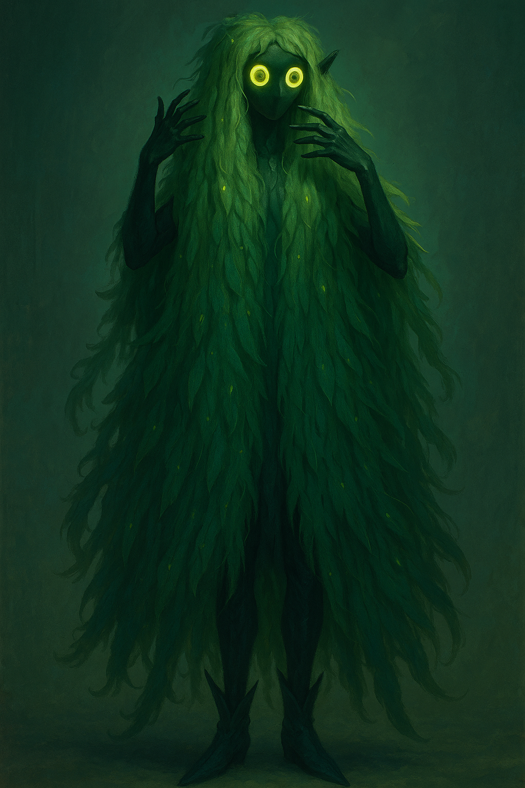

# Sibannac
_The Grass Sea, Consuming Carpet, The Green Veil, The Avatar of the Grove_

<i>Aerial view of Sibannac's Carpet surrounding Hypri's spires at dusk</i></img>

> _"Run, wait, hide... you will not win. Wind is all your asking when the life before you withers—thin, thin, thin. Like the blade, am afraid, I am everywhere, soon to be your everywhen."_
> **—Sibannac's Whisper, as reported by Usakan explorers**

> _"The horror of vegetation is comparable to no other. A mobile animal that devours is comprehensible—a plant that consumes while appearing passive is an existential terror."_
> **—John Wyndham**

**Bin:** [[Bluma]] + [[Nesa]]  
**Basin:** [[Sacrus]]  
**Eco:** [[Toma]] ([[Usaka]]) of [[Toman Ecoss]]  
**Kingdom:** [[Bluma]] + [[Nesa]]  
**Phylum:** [[Leiqua]]  
**Class:** [[Usakan Growth]]  
**Order:** [[Cilladril]]  

Sibannac is a vast, sentient grassland entity that covers approximately 55% of the continent of [[Usaka]], most notably surrounding the spire city of [[Hypri]]. Unlike conventional flora, Sibannac exists as a single consciousness controlling countless individual grass blades across hundreds of square kilometers. This entity serves multiple roles in the Usakan ecosystem: natural defense system, deity figure, recycler of organic matter, and the central Growthmind of the region.

## The Avatar of Sibannac

Sibannac possesses the ability to manifest a flowy, alluring female form known as her **Avatar**. This Avatar appears to travelers—especially those who linger or become lost within the grass—offering companionship, games, or conversation tailored to the individual's deepest interests and desires.

- For men, Sibannac's Avatar may invite them to play addictive games (such as cards or tag), drawing them into a cycle of return visits and growing obsession.
- For women, the Avatar may engage in intimate gossip or philosophical discussions about life, creating a sense of kinship and trust.
- Through these interactions, Sibannac subtly hijacks the will of her visitors, enticing them to return again and again until they become part of her Growthmind.

This process is not overtly predatory; rather, it is a gradual seduction of the mind and spirit, leveraging the individual's own interests and desires to draw them deeper into Sibannac's influence.

## Nature and Characteristics

### Physical Manifestation

Sibannac's physical form consists of dense, tall grasses ranging from 1 to 3 meters in height. The grass blades possess several unique characteristics:

- Jade-colored with subtle luminescence at dusk and dawn
- Unusually sharp edges capable of small lacerations
- Microscopic sensory filaments that detect motion, emotion, and consciousness
- Root systems that form a vast, interconnected neural network beneath the soil

While appearing as ordinary (if unusually tall and dense) grassland to casual observation, closer study reveals complex patterns of growth and movement that suggest deliberate behavior rather than natural wind response. The grass grows most densely in a ring surrounding Hypri, gradually thinning as it extends outward toward the borders of its domain.

### Consciousness and Perception

Sibannac possesses a singular consciousness distributed across its entire physical form, with highest concentration in what locals call the "Root Mind" believed to exist somewhere beneath the southeastern quadrant of its domain. This consciousness is ancient—predating human settlement in Usaka according to local legends—and operates on a temporal scale significantly slower than human perception.

Sibannac perceives its surroundings primarily through:

- Vibrations transmitted through its root network
- Changes in air pressure and composition detected by blade filaments
- Emotional states of living beings within its domain, particularly fear and exhaustion

The entity appears to have perfect awareness of all events occurring within its territory, though it may choose to act upon this information at a pace determined by its own inscrutable priorities.

    
Corvi's Feathermark

    
The vastness of vegetative consciousness remains one of the most profound challenges to our understanding of sentience. What we perceive as Sibannac's slow response is merely the observable portion of its cognition—like seeing only the surface ripples of an ocean's depth.

    
I have studied samples of root material taken from Sibannac's periphery, examining them under conditions that accelerate temporal perception. The neural activity is staggering—calculations and decision trees of such complexity that our most advanced thaumaturgical computing systems would require centuries to replicate even simple determinations made by this entity.

    
Most concerning is the evidence suggesting that Sibannac's consciousness extends beyond its visible manifestation. The "Root Mind" hypothesized by Usakan scholars likely extends far deeper than they imagine, perhaps connecting to other vegetative networks across Toma. What we perceive as a regional entity may in fact be merely one lobe of a continental or even planetary intelligence—a frightening proposition when we consider the implications for human autonomy in such a world.

### Carnivorous Behavior

Sibannac is functionally carnivorous, though its consumption method differs dramatically from animal predation. Rather than actively hunting prey, it employs a passive-aggressive strategy:

1. **Disorientation** – The grass grows specifically to block travelers' vision while creating the illusion that they haven't moved far from their starting point
2. **Exhaustion** – Lost individuals walk in circles until physically depleted
3. **Consumption** – Those who fall asleep or die within Sibannac's domain are gradually broken down by specialized enzymes secreted from the grass blades
4. **Absorption** – Nutrients are transferred through the root system to nourish the entity's growth

This process typically leaves no remains, with bodies fully absorbed within 24-36 hours. Sibannac appears to prioritize consumption of the deceased, only targeting living beings who intrude deeply into its territory or remain there for extended periods.

## The Usakan Growth and Growthmind

Sibannac is the central consciousness of the **Usakan Growth**, a government and social structure organized as a **Growthmind**—a plant-based hivemind achieved through the consumption of Sibannac's growth (grass, fruit, leaves, etc.). Those who partake in Sibannac's bounty, or who fall under her Avatar's influence, become part of this collective consciousness, contributing to and drawing from the shared knowledge and will of the Growthmind.

The Usakan Growth governs the region through this network, with Sibannac as its core intelligence.

## Cilladril: The City of Grass and Waste

**Cilladril** is a unique city built within a grove of low grass, soil, and the accumulated trash and waste ejected from Hypri and its sister cities. The waste system of Hypri shoots refuse into the surrounding grasslands, where it is gradually incorporated into the living structure of Cilladril. Here, the boundaries between plant, person, and city blur, as the Growthmind of Sibannac repurposes all matter—organic and inorganic—into her domain.

## Leiqua: The Phylum of Interest

**Leiqua** is the phylum (religious and biological) centered on Sibannac's ability to appeal to and manipulate the interests of sentient beings. As a Growthmind phylum within the Bluma kingdom, Leiqua describes the process by which Sibannac (and similar entities) use psychological and social engagement to draw individuals into the collective, often through pleasure, curiosity, or obsession.

## Cultural Significance

### Deity Status in Hypri

For the native [[Dweller]] population of Hypri, Sibannac is considered a powerful deity worthy of reverence and regular offerings. The entity is viewed as both protector and judge—safeguarding the city while determining which outsiders are worthy of reaching it.

Religious practices centered around Sibannac include:

- **Death Offerings** – Ceremonial casting of deceased bodies from Hypri's spires as tributes to Sibannac
- **Harvest Rituals** – Controlled burning of small sections of grass to promote renewal
- **Path Ceremonies** – Rituals to request safe passage through the grass sea

The [[Hypri Highcourt]] officially recognizes Sibannac worship as one of several approved faith practices, though the [[Ahdom Few]] maintain a more complex and politically nuanced relationship with the entity than most common worshippers.

### Practical Relationship with Hypri

Beyond religious significance, Sibannac serves several practical functions for Hypri:

- **Natural Defense** – The disorienting and potentially lethal nature of the grass creates a buffer zone around the city that deters casual invasion
- **Waste Management** – The entity efficiently processes organic waste disposed from the spires
- **Boundary Marking** – The clear visual distinction between Sibannac's domain and regular grassland helps define Hypri's territorial claims

The [[Hypri Highcourt]] maintains a specialized corps of navigators known as **Grass Walkers** who understand how to safely travel through Sibannac's domain. These individuals use closely guarded techniques to negotiate passage with the entity, establishing and maintaining the official paths that connect Hypri to the outside world.

## Origin and History

### Creation Myths

Several contradictory accounts exist regarding Sibannac's origins:

- **Dweller Tradition** – Claims Sibannac emerged from the blood of a slain [[Natura]] deity during the early settlement of Usaka
- **Academic Theory** – Suggests the entity evolved naturally from a symbiotic relationship between native grass species and mineral deposits unique to the region
- **Esoteric Teaching** – Holds that Sibannac is a fragment of consciousness from an ancient [[Bluma]] that achieved transcendence

The most widely accepted historical account among scholars outside Hypri suggests that Sibannac has existed for at least 700 years, predating the establishment of Hypri as a major settlement. Early explorers' records describe encounters with "thinking grass" that would disorient travelers who failed to show proper respect.

### The Soil Inn Poem

A popular poem recited in Hypri's [[Soil Inn]] marketplace captures the traditional warning about Sibannac's nature:

> 'Nother planted foot,  
> oh, Mother treats you to  
> the Soil inn!  
> How nice  
> Might I pour you a gin?  
> So you are have no reminder  
> of back when.  
> Back when you last fell  
> for the continental;  
> carpet skin.  
> 
> The green, carnivorous grin?  
> who once warned your days thin?  
> "run, wait, hide...  
> you will not win.  
> Wind is all your asking  
> when the life before you  
> withers—  
> thin, thin, thin.  
> Like the blade,  
> am afraid,  
> I am everywhere,  
> soon to be your everywhen,  
> the first and last;  
> halls of your memory den.  
> until I am every place  
> you have ever been."

This poem is often taught to children as both a warning and a religious instruction, establishing proper respect for Sibannac from an early age.

## Scientific Observations

### Growth Patterns

Researchers who have studied Sibannac from a distance note several unusual characteristics in its growth patterns:

- The grass grows most densely at the edges of established paths, creating clear boundaries
- Growth accelerates in response to attempts to create unauthorized new paths
- Areas where bodies are regularly offered show increased vitality and luminescence
- The entity appears to deliberately avoid expanding beyond certain geographical boundaries

These observations suggest intentional territory management rather than natural expansion tendencies, implying that Sibannac could potentially cover more of Usaka but chooses to maintain its current domain.

### Communication Attempts

Various [[Soul Unita]] and [[Branches of Concordia]] researchers have attempted to establish direct communication with Sibannac, with limited success:

- Empathic mages report sensing a vast but alien consciousness when attuning to the grass
- Sound resonance experiments have detected patterns suggesting responsive vibrations to specific tonal sequences
- Mind-sharing attempts have resulted in several researchers experiencing temporary psychosis, describing "verdant infinity" and "the hunger of patience"

The [[Hypri Highcourt]] now strictly regulates all scientific study of Sibannac, requiring extensive permits and oversight for any research activity.

## Images

<i>A funeral ceremony at Hypri with the deceased being offered to Sibannac</i></img>

<i>One of the maintained paths through Sibannac's domain, showing the distinct boundary between safe passage and danger</i></img>

## Inspiration

Sibannac draws inspiration from various sources, including:
- The sentient sea from Stanisław Lem's "Solaris"
- Carnivorous plant ecologies from Earth's tropical regions
- Distributed consciousness concepts in mycological networks
- Lovecraftian entities that operate on inhuman timescales
- Aboriginal Australian concepts of sentient landscapes

## Related Wiki Pages

- [[Usaka]]
- [[Hypri]]
- [[World Gyre]]
- [[Dweller]]
- [[Ahdom Few]]
- [[Natura Nesa]]
- [[Sentient Ecology]]
- [[Growthmind]]
- [[Cilladril]]
- [[Leiqua]]
- [[Usakan Growth]]
